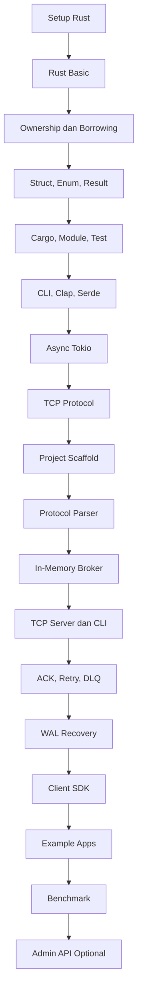

# 00 — Course Map

Dokumen ini adalah peta besar course **RQueue From Zero**.

Course ini dimulai dari setup Rust, lalu konsep dasar Rust, lalu masuk ke project message broker secara bertahap.

## Target akhir

Kamu akan membangun:

```text
rqueue-server
rqueue-client
rqueue-cli
rqueue-bench
examples/
```

Dengan fitur:

- TCP protocol
- topic queue
- publisher
- consumer
- ACK
- NACK
- retry
- Dead Letter Queue
- Write-Ahead Log
- crash recovery
- Rust client SDK
- example apps
- benchmark

## Urutan modul

```text
01_SETUP_RUST.md
02_RUST_BASIC.md
03_OWNERSHIP_BORROWING.md
04_STRUCT_ENUM_RESULT.md
05_CARGO_MODULE_TEST.md
06_CLI_CLAP_SERDE.md
07_ASYNC_TOKIO.md
08_TCP_PROTOCOL.md
09_PROJECT_SCAFFOLD.md
10_PROTOCOL_PARSER.md
11_IN_MEMORY_BROKER.md
12_TCP_SERVER_AND_CLI.md
13_ACK_RETRY_DLQ.md
14_WAL_RECOVERY.md
15_CLIENT_SDK.md
16_EXAMPLE_APPS.md
17_BENCHMARK.md
18_ADMIN_API_OPTIONAL.md
```

## Visualisasi perjalanan belajar



## Fase 1 — Rust fundamentals

Modul:

```text
01_SETUP_RUST.md
02_RUST_BASIC.md
03_OWNERSHIP_BORROWING.md
04_STRUCT_ENUM_RESULT.md
05_CARGO_MODULE_TEST.md
```

Tujuan:

- bisa menjalankan Rust
- paham `cargo`
- paham function, variable, struct, enum
- mulai paham ownership dan borrowing
- bisa menulis test sederhana

## Fase 2 — Tools untuk project

Modul:

```text
06_CLI_CLAP_SERDE.md
07_ASYNC_TOKIO.md
08_TCP_PROTOCOL.md
```

Tujuan:

- membuat CLI
- membaca dan menulis JSON
- memahami async Rust
- membuat TCP server sederhana
- memahami protocol text sederhana

## Fase 3 — Broker core

Modul:

```text
09_PROJECT_SCAFFOLD.md
10_PROTOCOL_PARSER.md
11_IN_MEMORY_BROKER.md
12_TCP_SERVER_AND_CLI.md
```

Tujuan:

- membuat workspace project
- memisahkan crate
- membuat parser protocol
- membuat broker in-memory
- menghubungkan broker dengan TCP server
- membuat CLI awal

## Fase 4 — Reliability

Modul:

```text
13_ACK_RETRY_DLQ.md
14_WAL_RECOVERY.md
```

Tujuan:

- memahami delivery semantics
- membuat ACK dan NACK
- membuat retry
- membuat Dead Letter Queue
- membuat WAL
- membuat recovery setelah server crash

## Fase 5 — Product surface

Modul:

```text
15_CLIENT_SDK.md
16_EXAMPLE_APPS.md
17_BENCHMARK.md
18_ADMIN_API_OPTIONAL.md
```

Tujuan:

- membuat SDK untuk publisher dan consumer
- membuat example apps
- membuat benchmark tool
- menambahkan Admin API optional

## Prinsip utama

Course ini tidak mengejar fitur sebanyak mungkin.

Course ini mengejar pemahaman:

```text
Kenapa sistemnya dibuat seperti ini?
Apa tradeoff-nya?
Bagaimana Rust membantu mencegah bug?
Bagaimana aplikasi lain memakai broker ini?
Bagaimana performanya diukur?
```
