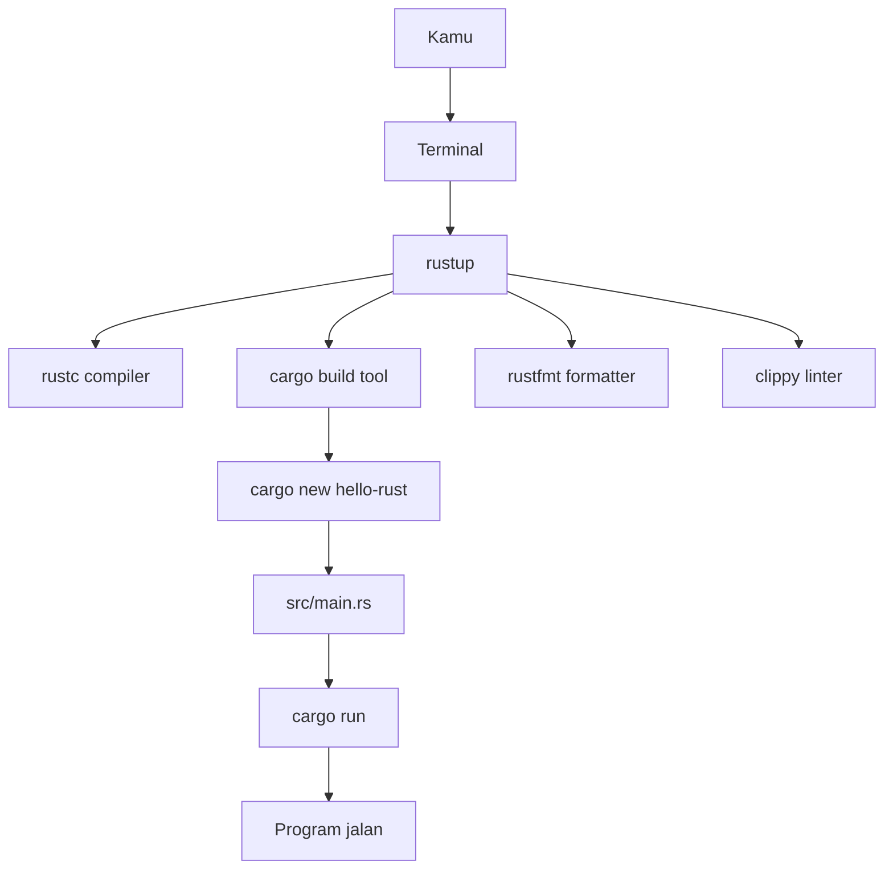
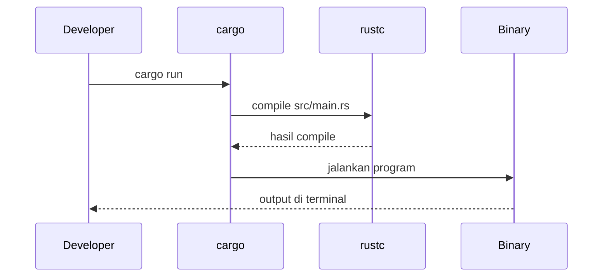

# 01 - Setup Rust dari Nol

Tujuan modul ini: Rust, Cargo, formatter, linter, dan editor siap dipakai.

---

## Visualisasi modul

Di modul ini kamu menyiapkan toolchain. Anggap Rust punya beberapa alat yang bekerja bareng: `rustup` mengurus instalasi, `rustc` meng-compile kode, `cargo` mengurus project, dependency, test, dan run.



Urutan mental model-nya:

1. Install `rustup` dulu.
2. `rustup` memasang `rustc` dan `cargo`.
3. `cargo new` membuat project.
4. `cargo run` melakukan compile lalu menjalankan binary.
5. `cargo fmt` merapikan kode.
6. `cargo clippy` memberi saran kualitas kode.



---
## 1. Istilah dasar

- `rustc`: compiler Rust.
- `cargo`: build tool dan package manager Rust.
- `rustup`: tool untuk install dan update Rust.
- `crate`: package/library Rust.
- `Cargo.toml`: file konfigurasi project.

Analogi kasar:

```txt
rustc  = javac / tsc compiler
cargo  = npm + maven/gradle-ish
rustup = sdkman/asdf-ish toolchain manager
```

---

## 2. Setup macOS Apple Silicon

Cek arsitektur:

```bash
uname -m
```

Kalau output `arm64`, berarti Apple Silicon.

Install Xcode Command Line Tools:

```bash
xcode-select --install
```

Install Rust:

```bash
curl --proto '=https' --tlsv1.2 -sSf https://sh.rustup.rs | sh
```

Aktifkan env:

```bash
source "$HOME/.cargo/env"
```

Cek:

```bash
rustc --version
cargo --version
rustup --version
```

---

## 3. Setup Linux ARM / Radxa

Cek arsitektur:

```bash
uname -m
```

Kalau output `aarch64`, itu ARM64 Linux.

Install dependency dasar:

```bash
sudo apt update
sudo apt install -y build-essential curl git pkg-config libssl-dev
```

Install Rust:

```bash
curl --proto '=https' --tlsv1.2 -sSf https://sh.rustup.rs | sh
source "$HOME/.cargo/env"
```

Cek:

```bash
rustc --version
cargo --version
```

---

## 4. Install komponen penting

```bash
rustup component add rustfmt
rustup component add clippy
rustup component add rust-src
```

Cek:

```bash
cargo fmt --version
cargo clippy --version
```

---

## 5. Setup editor

Rekomendasi: VS Code atau Cursor.

Install extension:

- `rust-analyzer`
- `Even Better TOML`
- `CodeLLDB`, optional

Setting berguna:

```json
{
  "rust-analyzer.check.command": "clippy",
  "editor.formatOnSave": true
}
```

---

## 6. Program pertama

```bash
mkdir -p ~/code
cd ~/code
cargo new hello-rust
cd hello-rust
cargo run
```

Isi default `src/main.rs`:

```rust
fn main() {
    println!("Hello, world!");
}
```

Output:

```txt
Hello, world!
```

---

## 7. Command Cargo harian

```bash
cargo check          # cek compile cepat
cargo build          # build debug
cargo build --release # build optimized
cargo run            # build lalu run
cargo test           # run test
cargo fmt            # format kode
cargo clippy         # linter
cargo doc --open     # generate docs
```

Biasakan sebelum commit:

```bash
cargo fmt
cargo clippy -- -D warnings
cargo test
```

---

## 8. Troubleshooting setup

### `cargo: command not found`

```bash
source "$HOME/.cargo/env"
```

Tutup terminal lalu buka lagi.

### Linux error OpenSSL

```bash
sudo apt install -y pkg-config libssl-dev
```

### macOS linker error

```bash
xcode-select --install
```

---

## Latihan

1. Buat project `hello-rust`.
2. Ubah print jadi nama kamu.
3. Jalankan `cargo run`.
4. Jalankan `cargo fmt` dan `cargo clippy`.
5. Commit.

```bash
git init
git add .
git commit -m "chore: create hello rust"
```

---

## Checkpoint

Lanjut kalau semua ini sukses:

```bash
rustc --version
cargo --version
cargo new hello-rust
cd hello-rust
cargo run
cargo fmt
cargo clippy
```
