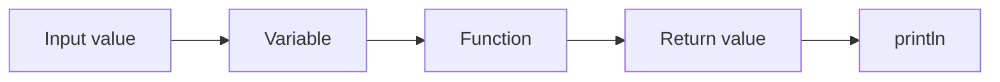
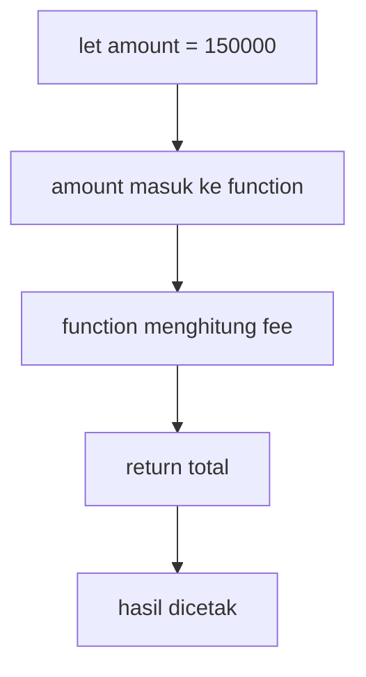
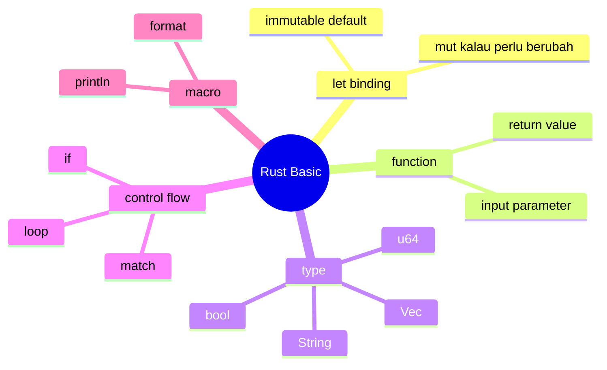

# 02 - Rust Basic: Variable, Type, Function, Control Flow

Tujuan: paham syntax dasar yang akan dipakai di RQueue.

---

## Visualisasi modul

Modul ini mengenalkan bentuk dasar program Rust: value disimpan di variable, diproses oleh function, lalu menghasilkan output. Jangan buru-buru mikir lifetime; pahami dulu aliran data paling sederhana.



Contoh mental model:



Rust basic yang dipakai terus di project RQueue:



---
## 1. Variable immutable dan mutable

Default Rust immutable:

```rust
fn main() {
    let count = 1;
    println!("{}", count);
}
```

Kalau mau bisa diubah:

```rust
fn main() {
    let mut count = 1;
    count += 1;
    println!("{}", count);
}
```

Kenapa penting? Broker punya state yang berubah saat publish, pull, ACK.

---

## 2. Type yang sering dipakai

```rust
let id: u64 = 1;
let attempts: u32 = 0;
let len: usize = 10;
let active: bool = true;
let ratio: f64 = 10.5;
```

Untuk RQueue:

```rust
type MessageId = u64;
```

---

## 3. String vs &str

`String` = owned string.

```rust
let topic = String::from("payments.created");
```

`&str` = borrowed string slice.

```rust
let topic: &str = "payments.created";
```

Rule awal:

- struct menyimpan text pakai `String`;
- function yang cuma baca text pakai `&str`.

Contoh:

```rust
struct Message {
    topic: String,
    payload: String,
}

fn normalize_topic(topic: &str) -> String {
    topic.trim().to_lowercase()
}
```

---

## 4. Function

```rust
fn add(a: i32, b: i32) -> i32 {
    a + b
}
```

Expression terakhir tanpa titik koma adalah return value.

```rust
fn normalize_topic(topic: &str) -> String {
    topic.trim().to_lowercase()
}
```

---

## 5. If expression

```rust
fn should_dead_letter(attempts: u32, max_attempts: u32) -> bool {
    attempts >= max_attempts
}

fn status(attempts: u32) -> &'static str {
    if attempts >= 3 {
        "dead-letter"
    } else {
        "retry"
    }
}
```

`if` bisa mengembalikan value.

---

## 6. Match

`match` sangat penting di Rust.

```rust
enum Command {
    Ping,
    Stats,
}

fn handle(command: Command) -> String {
    match command {
        Command::Ping => "PONG".to_string(),
        Command::Stats => "OK stats".to_string(),
    }
}
```

Nanti command parser RQueue akan memakai `match`.

---

## 7. Loop

```rust
for i in 0..3 {
    println!("{}", i);
}
```

TCP server nanti pakai infinite loop:

```rust
loop {
    let (socket, addr) = listener.accept().await?;
    println!("client connected: {}", addr);
}
```

---

## Latihan

Buat project `rust-basic`.

Isi function:

```rust
fn normalize_topic(topic: &str) -> String {
    topic.trim().to_lowercase()
}

fn should_retry(attempts: u32, max_attempts: u32) -> bool {
    attempts < max_attempts
}
```

Tambah test:

```rust
#[test]
fn normalize_topic_should_trim_and_lowercase() {
    assert_eq!(normalize_topic(" Payments.Created "), "payments.created");
}

#[test]
fn should_retry_when_attempts_below_max() {
    assert!(should_retry(1, 3));
    assert!(!should_retry(3, 3));
}
```

---

## Checkpoint

Kamu boleh lanjut kalau bisa menjelaskan:

- `let` vs `let mut`;
- `String` vs `&str`;
- function return;
- `if` sebagai expression;
- `match` untuk enum.
