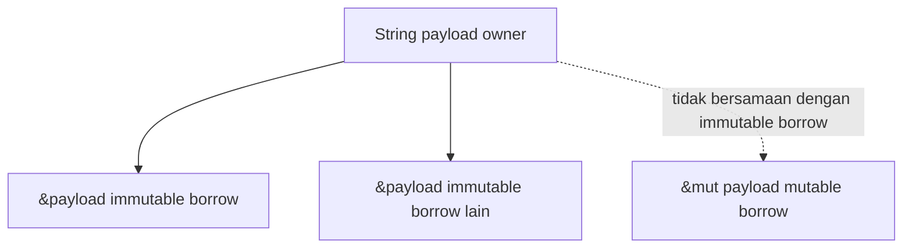
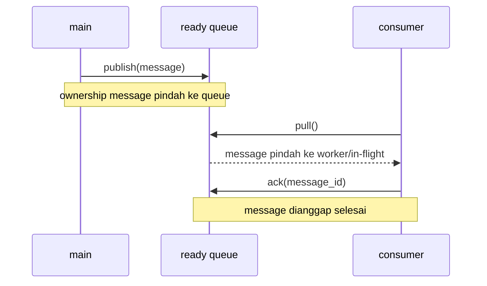

# 03 - Ownership dan Borrowing

Ini modul paling penting. Rust terasa susah karena ownership, bukan karena syntax.

---

## Visualisasi modul

Ownership adalah aturan siapa yang bertanggung jawab atas data. Ini terasa aneh di awal, tapi penting karena message broker menyimpan banyak message, memindahkan message dari ready queue ke in-flight, lalu menghapusnya saat ACK.


Borrowing artinya meminjam data tanpa mengambil kepemilikannya.



Aturan ringkas:

- Satu value punya satu owner.
- Saat owner keluar scope, value dibersihkan.
- Kamu bisa punya banyak immutable borrow.
- Kamu hanya bisa punya satu mutable borrow pada satu waktu.
- Tidak boleh mutable borrow dan immutable borrow aktif bersamaan untuk data yang sama.



---
## 1. Ownership dalam satu kalimat

Setiap value punya satu owner. Saat owner keluar scope, value dibersihkan.

```rust
fn main() {
    let name = String::from("akim");
    println!("{}", name);
} // name dibersihkan di sini
```

---

## 2. Move

```rust
fn main() {
    let a = String::from("hello");
    let b = a;

    println!("{}", b);
    // println!("{}", a); // error
}
```

`a` pindah ke `b`. Setelah pindah, `a` tidak boleh dipakai.

Kenapa? Supaya Rust tidak membersihkan memory yang sama dua kali.

---

## 3. Clone

Kalau butuh salinan:

```rust
fn main() {
    let a = String::from("hello");
    let b = a.clone();

    println!("{} {}", a, b);
}
```

Jangan asal clone. Di broker, payload bisa besar. Clone harus sadar.

---

## 4. Borrow immutable

Function bisa meminjam data.

```rust
fn print_topic(topic: &str) {
    println!("{}", topic);
}

fn main() {
    let topic = String::from("payments.created");
    print_topic(&topic);
    println!("{}", topic);
}
```

`print_topic` hanya membaca, jadi cukup `&str`.

---

## 5. Borrow mutable

Kalau function mengubah data:

```rust
fn increment(value: &mut u64) {
    *value += 1;
}

fn main() {
    let mut id = 1;
    increment(&mut id);
    println!("{}", id);
}
```

`*value` artinya dereference.

---

## 6. Rule utama borrow

Dalam satu waktu:

- boleh banyak immutable reference; atau
- boleh satu mutable reference.

Tidak boleh campur.

Contoh error:

```rust
fn main() {
    let mut topic = String::from("payments.created");
    let a = &topic;
    let b = &mut topic;
    println!("{} {}", a, b);
}
```

Kenapa? Kalau data bisa dibaca dan diubah bersamaan sembarangan, state bisa kacau.

Message broker butuh state konsisten. Queue tidak boleh berubah dari dua tempat tanpa kontrol.

---

## 7. Ownership di struct

```rust
struct Message {
    id: u64,
    topic: String,
    payload: String,
}

fn main() {
    let message = Message {
        id: 1,
        topic: "payments.created".to_string(),
        payload: "{}".to_string(),
    };

    let mut queue = Vec::new();
    queue.push(message);

    // message sudah pindah ke queue
}
```

Saat `queue.push(message)`, ownership message pindah ke queue.

---

## 8. Method dengan self

```rust
struct Broker {
    next_id: u64,
}

impl Broker {
    fn new() -> Self {
        Self { next_id: 1 }
    }

    fn next_message_id(&mut self) -> u64 {
        let id = self.next_id;
        self.next_id += 1;
        id
    }

    fn current_id(&self) -> u64 {
        self.next_id
    }
}
```

- `&self`: cuma membaca.
- `&mut self`: mengubah.
- `self`: mengambil ownership object.

---

## 9. Lifetime intuition

Lifetime memastikan reference tidak hidup lebih lama dari data yang dipinjam.

Kode ini salah:

```rust
fn bad() -> &String {
    let name = String::from("akim");
    &name
}
```

`name` hilang saat function selesai. Reference akan menunjuk data mati.

Solusi:

```rust
fn good() -> String {
    String::from("akim")
}
```

Rule pemula:

- struct simpan `String`, bukan `&str`;
- parameter function yang cuma baca pakai `&str`;
- return data buatan function sebagai owned value (`String`, struct, Vec, dll).

---

## 10. Pola RQueue

```rust
pub struct Message {
    pub id: u64,
    pub topic: String,
    pub payload: String,
}

pub struct Broker {
    next_id: u64,
}

impl Broker {
    pub fn publish(&mut self, topic: String, payload: String) -> u64 {
        let id = self.next_id;
        self.next_id += 1;
        id
    }
}
```

`publish` butuh `&mut self` karena mengubah `next_id` dan queue.

---

## Latihan

1. Perbaiki kode move error ini dengan borrow dan clone:

```rust
let payload = String::from("hello");
let a = payload;
println!("{}", payload);
```

2. Buat struct `Counter` dengan method `increment(&mut self) -> u64`.
3. Buat struct `Message` lalu masukkan ke `Vec<Message>`.

---

## Checkpoint

Lanjut kalau bisa menjelaskan:

- move;
- clone;
- borrow immutable;
- borrow mutable;
- kenapa Rust melarang dua mutable borrow;
- kapan pakai `String`, kapan pakai `&str`.
