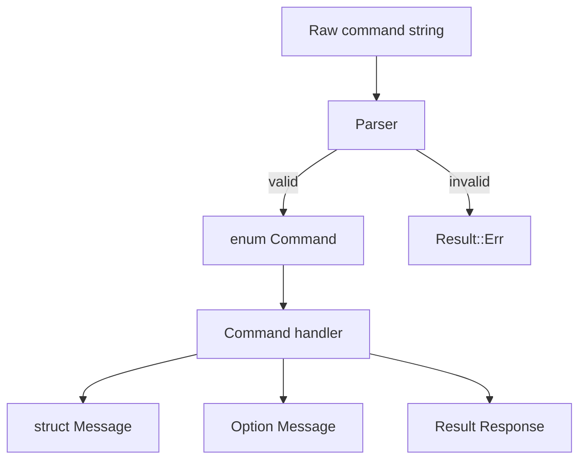
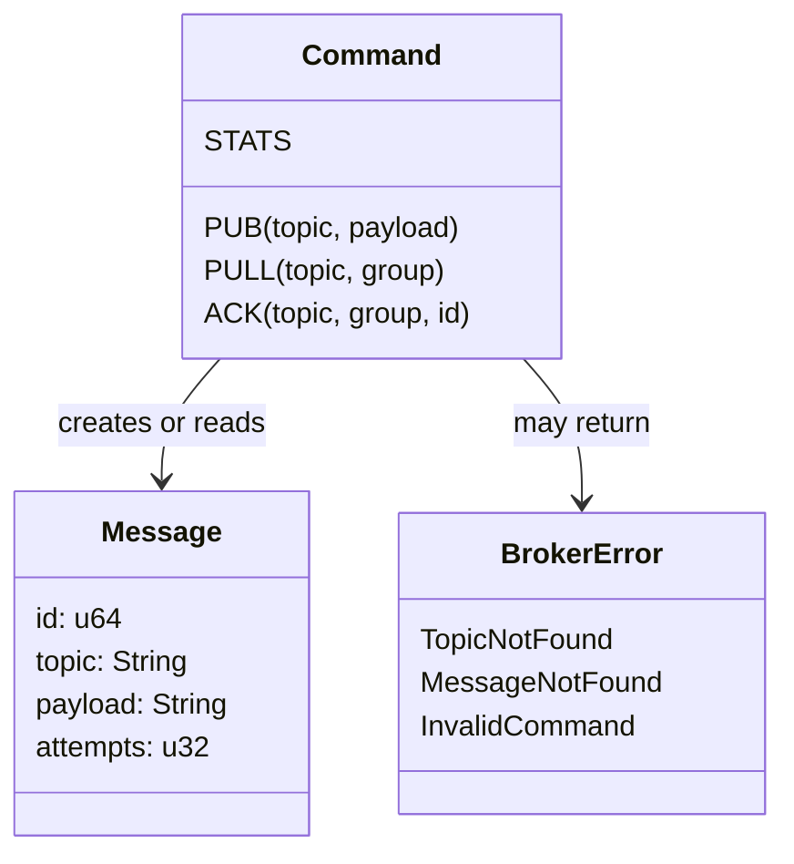

# 04 - Struct, Enum, Trait, Result, Option

Tujuan: belajar modeling domain RQueue dengan type Rust.

---

## Visualisasi modul

Di project RQueue, `struct`, `enum`, `Result`, dan `Option` adalah bahan utama. `struct` dipakai untuk bentuk data, `enum` untuk pilihan command/state, `Result` untuk operasi yang bisa gagal, dan `Option` untuk data yang mungkin ada atau tidak ada.



Contoh pemakaian di broker:



Mental model:

- `struct Message` = bentuk data message.
- `enum Command` = semua jenis perintah yang dikenal server.
- `Result<T, E>` = sukses berisi `T`, gagal berisi `E`.
- `Option<T>` = ada `Some(T)` atau kosong `None`.

---
## 1. Struct

Struct adalah kumpulan field.

```rust
#[derive(Debug, Clone, PartialEq, Eq)]
pub struct Message {
    pub id: u64,
    pub topic: String,
    pub payload: String,
    pub attempts: u32,
}

impl Message {
    pub fn new(id: u64, topic: String, payload: String) -> Self {
        Self { id, topic, payload, attempts: 0 }
    }
}
```

Pakai:

```rust
let message = Message::new(
    1,
    "payments.created".to_string(),
    "{}".to_string(),
);
```

---

## 2. Enum

Enum cocok untuk command protocol.

```rust
#[derive(Debug, Clone, PartialEq, Eq)]
pub enum Command {
    Ping,
    Stats,
    Pub { topic: String, payload: String },
    Pull { topic: String, group: String },
    Ack { topic: String, group: String, id: u64 },
    Nack { topic: String, group: String, id: u64 },
}
```

Handle dengan `match`:

```rust
fn command_name(command: &Command) -> &'static str {
    match command {
        Command::Ping => "PING",
        Command::Stats => "STATS",
        Command::Pub { .. } => "PUB",
        Command::Pull { .. } => "PULL",
        Command::Ack { .. } => "ACK",
        Command::Nack { .. } => "NACK",
    }
}
```

---

## 3. Enum untuk response

```rust
#[derive(Debug, Clone, PartialEq, Eq)]
pub enum Response {
    Pong,
    Ok(String),
    Error(String),
    Empty,
    Message { id: u64, topic: String, payload: String },
}

impl Response {
    pub fn encode(&self) -> String {
        match self {
            Response::Pong => "PONG\n".to_string(),
            Response::Ok(message) => format!("OK {}\n", message),
            Response::Error(message) => format!("ERR {}\n", message),
            Response::Empty => "EMPTY\n".to_string(),
            Response::Message { id, topic, payload } => {
                format!("MSG {} {} {}\n", id, topic, payload)
            }
        }
    }
}
```

---

## 4. Option

`Option<T>` artinya mungkin ada, mungkin tidak.

```rust
fn find_message(id: u64) -> Option<Message> {
    if id == 1 {
        Some(Message::new(1, "a".to_string(), "{}".to_string()))
    } else {
        None
    }
}
```

Di broker:

```rust
pub fn pull(&mut self, topic: &str, group: &str) -> Option<Message> {
    // Some(message) kalau ada
    // None kalau kosong
}
```

---

## 5. Result

`Result<T, E>` artinya operasi bisa sukses atau gagal.

```rust
fn parse_id(input: &str) -> Result<u64, String> {
    input.parse::<u64>().map_err(|_| format!("invalid id: {}", input))
}
```

Pakai `?` untuk propagate error:

```rust
fn parse_ack_id(input: &str) -> Result<u64, String> {
    let id = input.parse::<u64>().map_err(|_| "invalid id".to_string())?;
    Ok(id)
}
```

---

## 6. Custom error

Manual:

```rust
#[derive(Debug, PartialEq, Eq)]
pub enum ProtocolError {
    EmptyCommand,
    UnknownCommand(String),
    MissingArgument(&'static str),
    InvalidMessageId(String),
}
```

Dengan `thiserror` nanti:

```rust
use thiserror::Error;

#[derive(Debug, Error, PartialEq, Eq)]
pub enum ProtocolError {
    #[error("empty command")]
    EmptyCommand,

    #[error("unknown command: {0}")]
    UnknownCommand(String),

    #[error("missing argument: {0}")]
    MissingArgument(&'static str),

    #[error("invalid message id: {0}")]
    InvalidMessageId(String),
}
```

---

## 7. Trait singkat

Trait adalah kontrak behavior.

```rust
trait Encoder {
    fn encode(&self) -> String;
}

impl Encoder for Response {
    fn encode(&self) -> String {
        "TODO".to_string()
    }
}
```

Untuk course ini, kita tidak harus banyak pakai trait. Tapi konsepnya penting.

---

## Latihan

1. Buat enum `MessageState`: `Ready`, `InFlight`, `Acked`, `DeadLetter`.
2. Buat function `is_terminal(state: MessageState) -> bool`.
3. Buat enum `Command` dan function `command_name`.
4. Buat function `parse_u64(input: &str) -> Result<u64, String>`.

---

## Checkpoint

Lanjut kalau bisa:

- bikin struct dan method;
- bikin enum dengan data;
- pakai `match`;
- pakai `Option`;
- pakai `Result` dan `?`;
- bikin custom error sederhana.
