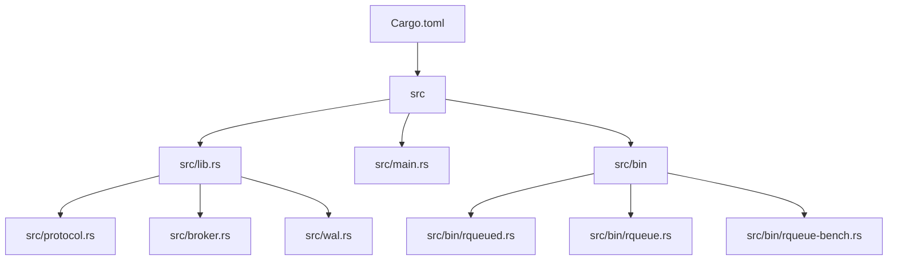
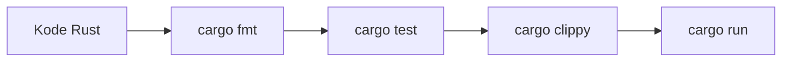
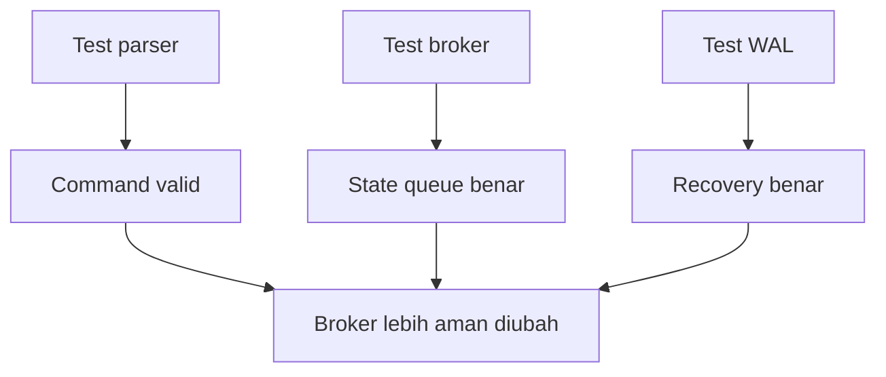

# 05 - Cargo, Module, Testing, dan Docs

Tujuan: project Rust rapi dan bisa dites.

---

## Visualisasi modul

Modul ini mengajarkan cara project Rust dipecah. RQueue tidak akan ditulis dalam satu file besar. Kita butuh module supaya parser, broker, server, WAL, dan CLI bisa dipisah.



Alur command Cargo:



Kenapa test penting di project ini:



---
## 1. Binary vs library

Binary:

```txt
src/main.rs
```

Library:

```txt
src/lib.rs
```

RQueue akan punya library dan beberapa binary:

```txt
src/
├── lib.rs
├── protocol.rs
├── broker.rs
├── wal.rs
├── admin.rs
└── bin/
    ├── rqueued.rs
    ├── rqueue.rs
    └── rqueue-bench.rs
```

Kenapa logic di library? Supaya bisa dipakai server, CLI, benchmark, dan test.

---

## 2. Module

`src/lib.rs`:

```rust
pub mod protocol;
pub mod broker;
```

`src/protocol.rs`:

```rust
pub fn normalize_topic(topic: &str) -> String {
    topic.trim().to_lowercase()
}
```

Pakai dari binary:

```rust
use rqueue::protocol::normalize_topic;

fn main() {
    println!("{}", normalize_topic(" Payments.Created "));
}
```

---

## 3. Unit test

Di file yang sama:

```rust
pub fn normalize_topic(topic: &str) -> String {
    topic.trim().to_lowercase()
}

#[cfg(test)]
mod tests {
    use super::*;

    #[test]
    fn normalize_topic_should_trim_and_lowercase() {
        assert_eq!(normalize_topic(" Payments.Created "), "payments.created");
    }
}
```

Run:

```bash
cargo test
```

---

## 4. Integration test

Folder:

```bash
mkdir tests
```

`tests/protocol_test.rs`:

```rust
use rqueue::protocol::normalize_topic;

#[test]
fn normalize_topic_should_work_from_integration_test() {
    assert_eq!(normalize_topic(" A.B "), "a.b");
}
```

---

## 5. Test naming

Bagus:

```rust
#[test]
fn publish_should_generate_incrementing_message_id() {}

#[test]
fn ack_should_remove_message_from_in_flight() {}
```

Jelek:

```rust
#[test]
fn test1() {}
```

---

## 6. Rustdoc

```rust
/// Normalize topic by trimming whitespace and converting to lowercase.
pub fn normalize_topic(topic: &str) -> String {
    topic.trim().to_lowercase()
}
```

Generate docs:

```bash
cargo doc --open
```

---

## 7. Pre-commit manual

Sebelum commit:

```bash
cargo fmt
cargo clippy -- -D warnings
cargo test
git status
```

---

## Latihan

1. Buat project `module-test`.
2. Tambah `src/lib.rs` dan `src/protocol.rs`.
3. Buat function `normalize_topic`.
4. Tambah unit test.
5. Tambah integration test.
6. Jalankan `cargo test`.

---

## Checkpoint

Lanjut kalau bisa:

- export module dari `lib.rs`;
- import module dari binary;
- tulis unit test;
- tulis integration test;
- jalankan `cargo fmt`, `cargo clippy`, `cargo test`.
