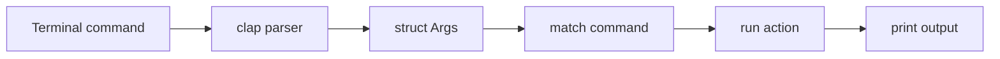
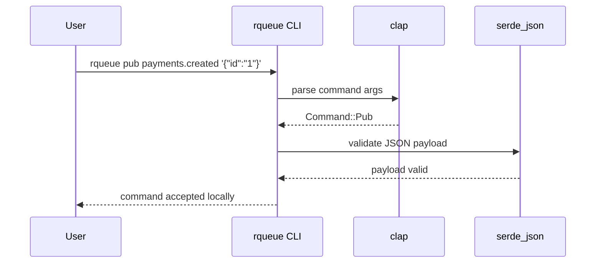
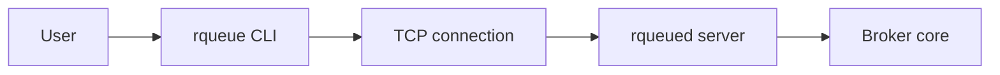

# 06 - CLI dengan clap dan JSON dengan Serde

Tujuan: membuat command line interface dan memahami JSON serialization.

---

## Visualisasi modul

Di modul ini kamu membuat program CLI. CLI adalah cara manusia mengirim perintah ke broker lewat terminal. `clap` membantu membaca argumen terminal, sedangkan `serde` membantu membaca/menulis data seperti JSON.



Contoh:



Di project final, CLI akan berkembang menjadi client TCP:



---
## 1. Tambah dependency

Di `Cargo.toml`:

```toml
[dependencies]
clap = { version = "4", features = ["derive"] }
serde = { version = "1", features = ["derive"] }
serde_json = "1"
```

Atau:

```bash
cargo add clap --features derive
cargo add serde --features derive
cargo add serde_json
```

---

## 2. CLI sederhana

```rust
use clap::Parser;

#[derive(Debug, Parser)]
#[command(name = "rqueue")]
#[command(about = "RQueue CLI")]
struct Cli {
    #[arg(long, default_value = "127.0.0.1:7379")]
    addr: String,
}

fn main() {
    let cli = Cli::parse();
    println!("addr = {}", cli.addr);
}
```

Run:

```bash
cargo run -- --addr 127.0.0.1:9999
```

---

## 3. Subcommand

```rust
use clap::{Parser, Subcommand};

#[derive(Debug, Parser)]
#[command(name = "rqueue")]
struct Cli {
    #[arg(long, default_value = "127.0.0.1:7379")]
    addr: String,

    #[command(subcommand)]
    command: Commands,
}

#[derive(Debug, Subcommand)]
enum Commands {
    Ping,
    Stats,
    Pub { topic: String, payload: String },
    Pull { topic: String, group: String },
    Ack { topic: String, group: String, id: u64 },
    Nack { topic: String, group: String, id: u64 },
}

fn main() {
    let cli = Cli::parse();
    println!("{:?}", cli);
}
```

Run:

```bash
cargo run -- ping
cargo run -- pub payments.created '{"id":"trx_001"}'
cargo run -- pull payments.created fraud-worker
cargo run -- ack payments.created fraud-worker 1
```

---

## 4. Ubah CLI command ke protocol line

```rust
fn to_protocol_line(command: Commands) -> String {
    match command {
        Commands::Ping => "PING".to_string(),
        Commands::Stats => "STATS".to_string(),
        Commands::Pub { topic, payload } => format!("PUB {} {}", topic, payload),
        Commands::Pull { topic, group } => format!("PULL {} {}", topic, group),
        Commands::Ack { topic, group, id } => format!("ACK {} {} {}", topic, group, id),
        Commands::Nack { topic, group, id } => format!("NACK {} {} {}", topic, group, id),
    }
}
```

---

## 5. Serde JSON

```rust
use serde::{Deserialize, Serialize};

#[derive(Debug, Serialize, Deserialize)]
struct PaymentCreated {
    id: String,
    amount: u64,
}

fn main() -> Result<(), Box<dyn std::error::Error>> {
    let event = PaymentCreated {
        id: "trx_001".to_string(),
        amount: 150000,
    };

    let json = serde_json::to_string(&event)?;
    println!("{}", json);

    let parsed: PaymentCreated = serde_json::from_str(&json)?;
    println!("{:?}", parsed);

    Ok(())
}
```

---

## 6. Validasi payload JSON di CLI

```rust
fn validate_json(payload: &str) -> Result<(), serde_json::Error> {
    let _: serde_json::Value = serde_json::from_str(payload)?;
    Ok(())
}
```

Sebelum publish:

```rust
if let Commands::Pub { payload, .. } = &cli.command {
    validate_json(payload)?;
}
```

---

## Latihan

1. Buat CLI dengan subcommand `ping`, `stats`, `pub`, `pull`, `ack`, `nack`.
2. Buat function `to_protocol_line`.
3. Tambah validasi JSON untuk payload `pub`.
4. Jalankan `cargo run -- --help`.

---

## Checkpoint

Lanjut kalau bisa:

- membuat CLI dengan clap;
- membuat subcommand;
- membaca argument;
- serialize/deserialize JSON;
- validasi JSON payload.
