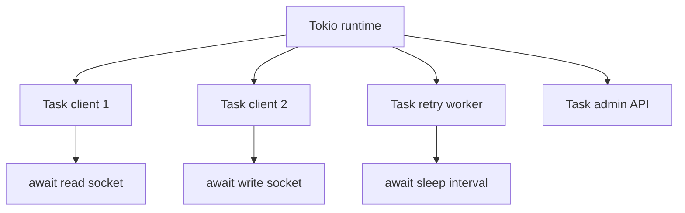
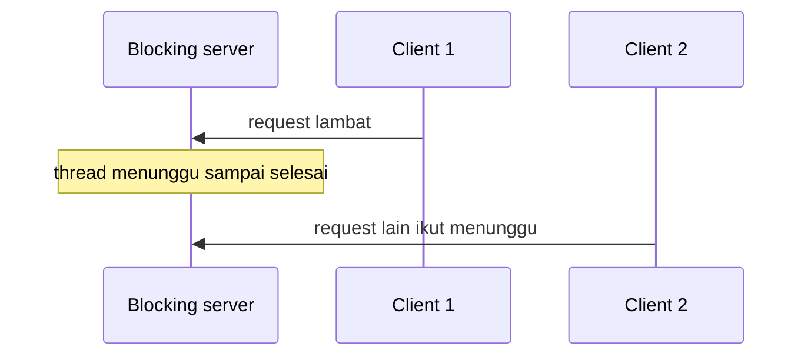
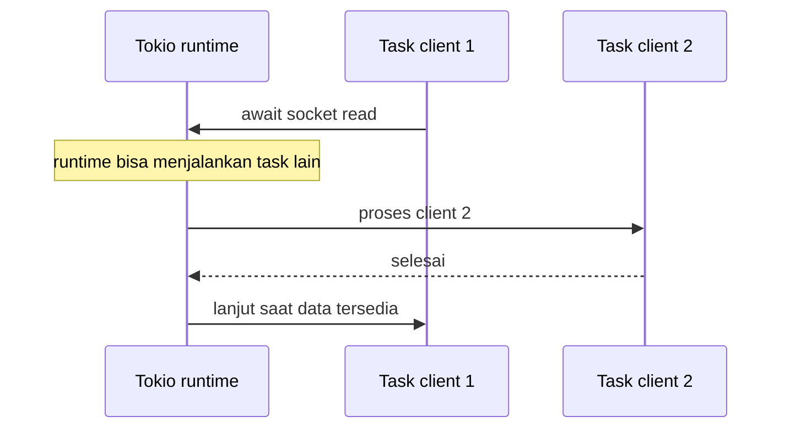

# 07 - Async Rust dan Tokio

Tujuan: paham async/await, task, shared state, dan kenapa TCP server memakai Tokio.

---

## Visualisasi modul

Async dipakai karena broker harus melayani banyak client sekaligus. Kalau satu client lambat, client lain tidak boleh ikut macet. Tokio menyediakan runtime untuk menjalankan banyak task asynchronous.



Bedanya blocking dan async:





Di RQueue, async dipakai untuk:

- menerima koneksi TCP banyak client;
- membaca command dari socket;
- menulis response;
- menjalankan retry worker berkala;
- menjalankan admin HTTP API.

---
## 1. Kenapa async?

Server network banyak menunggu:

- client mengirim data;
- socket siap dibaca;
- socket siap ditulis;
- timer retry;
- file I/O.

Async membuat satu runtime bisa mengelola banyak pekerjaan yang sedang menunggu tanpa membuat satu thread per client.

---

## 2. Tambah Tokio

```toml
[dependencies]
tokio = { version = "1", features = ["full"] }
```

---

## 3. Async main

```rust
#[tokio::main]
async fn main() {
    println!("hello async");
}
```

`#[tokio::main]` membuat runtime Tokio.

---

## 4. Sleep async

```rust
use tokio::time::{sleep, Duration};

#[tokio::main]
async fn main() {
    println!("start");
    sleep(Duration::from_secs(1)).await;
    println!("done");
}
```

`.await` menunggu Future selesai.

---

## 5. Spawn task

```rust
use tokio::time::{sleep, Duration};

#[tokio::main]
async fn main() {
    let task = tokio::spawn(async {
        sleep(Duration::from_millis(500)).await;
        println!("task done");
    });

    println!("main continues");
    task.await.unwrap();
}
```

`tokio::spawn` menjalankan task concurrent.

---

## 6. Shared state dengan Arc<Mutex<T>>

TCP server punya banyak client task, tapi broker state hanya satu.

```rust
use std::sync::Arc;
use tokio::sync::Mutex;

#[derive(Default)]
struct Counter {
    value: u64,
}

#[tokio::main]
async fn main() {
    let counter = Arc::new(Mutex::new(Counter::default()));

    let c1 = counter.clone();
    let t1 = tokio::spawn(async move {
        let mut guard = c1.lock().await;
        guard.value += 1;
    });

    let c2 = counter.clone();
    let t2 = tokio::spawn(async move {
        let mut guard = c2.lock().await;
        guard.value += 1;
    });

    t1.await.unwrap();
    t2.await.unwrap();

    let guard = counter.lock().await;
    println!("value={}", guard.value);
}
```

Penjelasan:

- `Arc`: data bisa dibagi ke banyak task.
- `Mutex`: hanya satu task mengubah data pada satu waktu.
- `lock().await`: menunggu lock tanpa block thread runtime.

---

## 7. Jangan tahan lock saat I/O

Buruk:

```rust
let mut broker = broker.lock().await;
slow_network_call().await;
broker.publish(...);
```

Baik:

```rust
let result = slow_network_call().await;
let mut broker = broker.lock().await;
broker.publish(...);
```

Prinsip: lock hanya saat baca/ubah state, jangan ditahan saat operasi lambat.

---

## 8. Channel

```rust
use tokio::sync::mpsc;

#[tokio::main]
async fn main() {
    let (tx, mut rx) = mpsc::channel::<String>(100);

    tokio::spawn(async move {
        tx.send("hello".to_string()).await.unwrap();
    });

    if let Some(message) = rx.recv().await {
        println!("received: {}", message);
    }
}
```

Channel bisa dipakai untuk background worker. RQueue versi awal cukup dengan `Arc<Mutex<Broker>>`.

---

## Latihan

1. Spawn 10 task.
2. Semua task increment shared counter.
3. Print hasil akhir 10.
4. Buat channel dan kirim 5 message.
5. Jelaskan kenapa `Arc` perlu di-clone.

---

## Checkpoint

Lanjut kalau paham:

- async/await;
- `tokio::main`;
- `tokio::spawn`;
- `Arc<Mutex<T>>`;
- risiko menahan lock terlalu lama.
