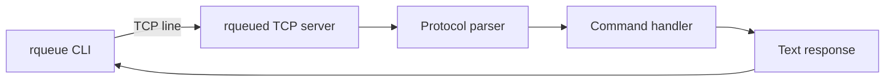
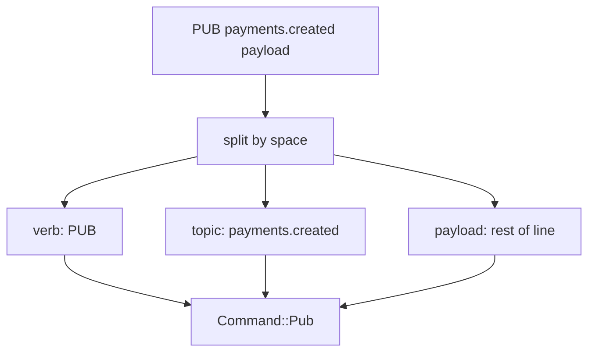
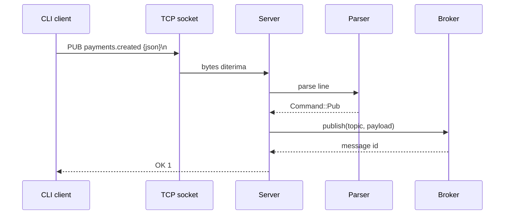

# 08 - TCP Server dan Protocol Design

Tujuan: membuat TCP server dan line protocol sederhana.

---

## Visualisasi modul

TCP adalah jalur komunikasi antara CLI dan server. Protocol adalah aturan teks yang kita sepakati supaya server tahu command apa yang dikirim client.



Format command awal:



Alur request/response:



---
## 1. TCP server itu apa?

Server mendengarkan alamat:

```txt
127.0.0.1:7379
```

Client connect, kirim bytes, server balas bytes.

RQueue akan memakai protocol berbasis baris:

```txt
PING
PUB payments.created {"id":"trx_001"}
PULL payments.created fraud-worker
ACK payments.created fraud-worker 1
```

Setiap command diakhiri newline `\n`.

---

## 2. Kenapa line protocol?

Kelebihan:

- gampang debug pakai `nc`;
- bisa dibaca manusia;
- parser awal lebih mudah.

Kekurangan:

- payload newline butuh escaping;
- lebih verbose dari binary protocol;
- perlu limit panjang line.

Untuk belajar, line protocol cukup.

---

## 3. TCP echo server

```rust
use tokio::io::{AsyncBufReadExt, AsyncWriteExt, BufReader};
use tokio::net::{TcpListener, TcpStream};

#[tokio::main]
async fn main() -> Result<(), Box<dyn std::error::Error>> {
    let listener = TcpListener::bind("127.0.0.1:7379").await?;
    println!("listening on 127.0.0.1:7379");

    loop {
        let (socket, addr) = listener.accept().await?;
        println!("client connected: {}", addr);

        tokio::spawn(async move {
            if let Err(err) = handle_client(socket).await {
                eprintln!("client error: {}", err);
            }
        });
    }
}

async fn handle_client(socket: TcpStream) -> Result<(), Box<dyn std::error::Error>> {
    let (reader, mut writer) = socket.into_split();
    let mut reader = BufReader::new(reader);
    let mut line = String::new();

    loop {
        line.clear();
        let bytes = reader.read_line(&mut line).await?;

        if bytes == 0 {
            break;
        }

        let request = line.trim();
        let response = format!("echo: {}\n", request);
        writer.write_all(response.as_bytes()).await?;
    }

    Ok(())
}
```

Run server:

```bash
cargo run
```

Terminal lain:

```bash
nc 127.0.0.1 7379
```

Ketik:

```txt
PING
```

Output:

```txt
echo: PING
```

---

## 4. Command mapping RQueue

Request:

```txt
PING
STATS
PUB <topic> <payload>
PULL <topic> <group>
ACK <topic> <group> <id>
NACK <topic> <group> <id>
```

Response:

```txt
PONG
OK <message>
ERR <message>
EMPTY
MSG <id> <topic> <payload>
```

---

## 5. Parser strategy

Untuk `PUB`, payload bisa mengandung spasi. Jadi jangan pakai `split_whitespace` untuk semua.

Pakai:

```rust
let mut head = line.splitn(2, ' ');
let command = head.next().unwrap();
let rest = head.next().unwrap_or("");
```

Untuk `PUB`, split rest maksimal dua bagian:

```rust
let mut parts = rest.splitn(2, ' ');
let topic = parts.next().unwrap();
let payload = parts.next().unwrap();
```

Untuk `ACK`, aman pakai whitespace:

```rust
let parts: Vec<&str> = rest.split_whitespace().collect();
```

---

## Latihan

1. Buat TCP echo server.
2. Tambahkan command `PING` yang balas `PONG`.
3. Tambahkan command unknown yang balas `ERR unknown command`.
4. Test pakai `nc`.

---

## Checkpoint

Lanjut kalau bisa:

- bind TCP listener;
- accept client;
- spawn task per client;
- baca line dari socket;
- tulis response;
- memahami format protocol RQueue.
