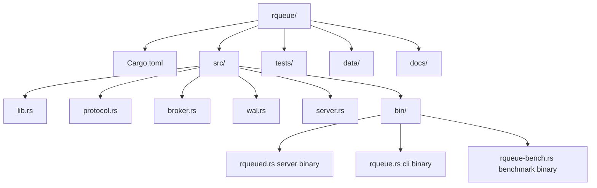
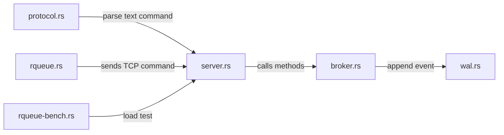

# 09 - Project Scaffold RQueue

Tujuan: membuat struktur project final.

---

## Visualisasi modul

Scaffold adalah kerangka folder project. Tujuannya supaya dari awal kamu tahu file mana menyimpan tanggung jawab apa. Ini menghindari project berubah jadi satu file raksasa.



Tanggung jawab file:



Aturan sederhana:

- `protocol.rs` tidak tahu detail queue.
- `broker.rs` tidak tahu detail TCP.
- `wal.rs` tidak tahu detail CLI.
- `server.rs` menghubungkan protocol, broker, dan socket.

---
## 1. Buat project

```bash
cd ~/code
cargo new rqueue
cd rqueue
mkdir -p src/bin tests docs data
```

`.gitignore`:

```bash
cat > .gitignore <<'GITIGNORE'
/target
/data
.env
.DS_Store
*.log
GITIGNORE
```

---

## 2. Cargo.toml

```toml
[package]
name = "rqueue"
version = "0.1.0"
edition = "2024"

[dependencies]
axum = "0.8"
clap = { version = "4", features = ["derive"] }
serde = { version = "1", features = ["derive"] }
serde_json = "1"
thiserror = "2"
tokio = { version = "1", features = ["full"] }
tracing = "0.1"
tracing-subscriber = { version = "0.3", features = ["env-filter"] }
```

---

## 3. File structure

```bash
touch src/lib.rs
touch src/protocol.rs
touch src/broker.rs
touch src/wal.rs
touch src/admin.rs
touch src/bin/rqueued.rs
touch src/bin/rqueue.rs
touch src/bin/rqueue-bench.rs
```

`src/lib.rs`:

```rust
pub mod admin;
pub mod broker;
pub mod protocol;
pub mod wal;
```

`src/bin/rqueued.rs`:

```rust
fn main() {
    println!("rqueued server will start here");
}
```

`src/bin/rqueue.rs`:

```rust
fn main() {
    println!("rqueue cli will start here");
}
```

`src/bin/rqueue-bench.rs`:

```rust
fn main() {
    println!("rqueue benchmark will start here");
}
```

---

## 4. Test scaffold

```bash
cargo run --bin rqueued
cargo run --bin rqueue
cargo run --bin rqueue-bench
cargo fmt
cargo test
```

---

## 5. Commit

```bash
git init
git add .
git commit -m "chore: scaffold rqueue project"
```

---

## Checkpoint

Lanjut kalau semua binary bisa dijalankan.
