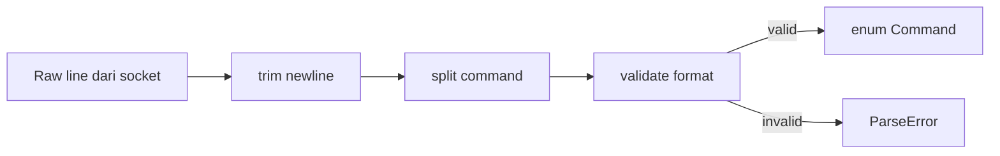
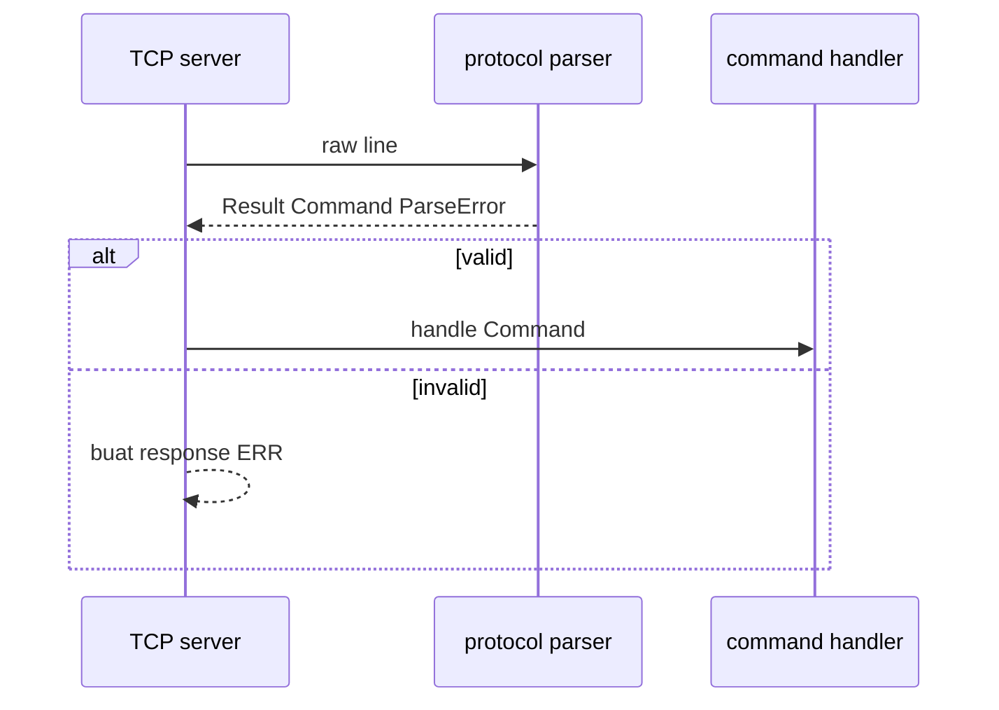

# 10 - Milestone 1: Protocol Parser

Tujuan: mengubah raw text command menjadi enum Rust.

---

## Visualisasi modul

Parser mengubah teks mentah dari TCP menjadi `enum Command`. Ini penting supaya sisa program tidak perlu membaca string manual terus-menerus.



Contoh command:

```mermaid
flowchart TB
    A["PUB payments.created {json}"] --> B[verb = PUB]
    B --> C[topic = payments.created]
    C --> D[payload = {json}]
    D --> E[Command::Pub topic payload]
```

Parser tidak menjalankan command. Parser hanya menerjemahkan.



Prinsip desain parser:

- Input boleh berantakan.
- Output harus rapi: `Command` atau `ParseError`.
- Error message harus cukup jelas untuk user CLI.
- Parser harus punya unit test banyak.

---
## 1. Protocol

Request:

```txt
PING
STATS
PUB <topic> <payload-json>
PULL <topic> <group>
ACK <topic> <group> <message-id>
NACK <topic> <group> <message-id>
```

Response:

```txt
PONG
OK <message>
ERR <message>
EMPTY
MSG <id> <topic> <payload-json>
```

---

## 2. Isi `src/protocol.rs`

```rust
use thiserror::Error;

#[derive(Debug, Clone, PartialEq, Eq)]
pub enum Command {
    Ping,
    Stats,
    Pub { topic: String, payload: String },
    Pull { topic: String, group: String },
    Ack { topic: String, group: String, id: u64 },
    Nack { topic: String, group: String, id: u64 },
}

#[derive(Debug, Clone, PartialEq, Eq)]
pub enum Response {
    Pong,
    Ok(String),
    Error(String),
    Empty,
    Message { id: u64, topic: String, payload: String },
}

impl Response {
    pub fn encode(&self) -> String {
        match self {
            Response::Pong => "PONG\n".to_string(),
            Response::Ok(message) => format!("OK {}\n", message),
            Response::Error(message) => format!("ERR {}\n", message),
            Response::Empty => "EMPTY\n".to_string(),
            Response::Message { id, topic, payload } => {
                format!("MSG {} {} {}\n", id, topic, payload)
            }
        }
    }
}

#[derive(Debug, Error, PartialEq, Eq)]
pub enum ProtocolError {
    #[error("empty command")]
    EmptyCommand,

    #[error("unknown command: {0}")]
    UnknownCommand(String),

    #[error("missing argument: {0}")]
    MissingArgument(&'static str),

    #[error("invalid message id: {0}")]
    InvalidMessageId(String),
}
```

---

## 3. Parser

Tambahkan di file yang sama:

```rust
pub fn parse_command(line: &str) -> Result<Command, ProtocolError> {
    let line = line.trim();

    if line.is_empty() {
        return Err(ProtocolError::EmptyCommand);
    }

    let mut head = line.splitn(2, ' ');
    let command = head.next().unwrap().to_uppercase();
    let rest = head.next().unwrap_or("").trim();

    match command.as_str() {
        "PING" => Ok(Command::Ping),
        "STATS" => Ok(Command::Stats),
        "PUB" => parse_pub(rest),
        "PULL" => parse_pull(rest),
        "ACK" => parse_ack_like(rest, true),
        "NACK" => parse_ack_like(rest, false),
        other => Err(ProtocolError::UnknownCommand(other.to_string())),
    }
}

fn parse_pub(rest: &str) -> Result<Command, ProtocolError> {
    let mut parts = rest.splitn(2, ' ');
    let topic = parts
        .next()
        .filter(|value| !value.is_empty())
        .ok_or(ProtocolError::MissingArgument("topic"))?;

    let payload = parts
        .next()
        .filter(|value| !value.is_empty())
        .ok_or(ProtocolError::MissingArgument("payload"))?;

    Ok(Command::Pub {
        topic: normalize_name(topic),
        payload: payload.to_string(),
    })
}

fn parse_pull(rest: &str) -> Result<Command, ProtocolError> {
    let parts: Vec<&str> = rest.split_whitespace().collect();
    let topic = parts.get(0).ok_or(ProtocolError::MissingArgument("topic"))?;
    let group = parts.get(1).ok_or(ProtocolError::MissingArgument("group"))?;

    Ok(Command::Pull {
        topic: normalize_name(topic),
        group: normalize_name(group),
    })
}

fn parse_ack_like(rest: &str, ack: bool) -> Result<Command, ProtocolError> {
    let parts: Vec<&str> = rest.split_whitespace().collect();
    let topic = parts.get(0).ok_or(ProtocolError::MissingArgument("topic"))?;
    let group = parts.get(1).ok_or(ProtocolError::MissingArgument("group"))?;
    let raw_id = parts.get(2).ok_or(ProtocolError::MissingArgument("id"))?;

    let id = raw_id
        .parse::<u64>()
        .map_err(|_| ProtocolError::InvalidMessageId((*raw_id).to_string()))?;

    if ack {
        Ok(Command::Ack { topic: normalize_name(topic), group: normalize_name(group), id })
    } else {
        Ok(Command::Nack { topic: normalize_name(topic), group: normalize_name(group), id })
    }
}

pub fn normalize_name(value: &str) -> String {
    value.trim().to_lowercase()
}
```

---

## 4. Test

Tambahkan di bawah:

```rust
#[cfg(test)]
mod tests {
    use super::*;

    #[test]
    fn parse_ping_should_work() {
        assert_eq!(parse_command("PING").unwrap(), Command::Ping);
    }

    #[test]
    fn parse_pub_should_keep_payload() {
        let command = parse_command("PUB Payments.Created {\"id\":\"trx_001\"}").unwrap();
        assert_eq!(command, Command::Pub {
            topic: "payments.created".to_string(),
            payload: "{\"id\":\"trx_001\"}".to_string(),
        });
    }

    #[test]
    fn parse_ack_should_parse_id() {
        let command = parse_command("ACK payments.created fraud-worker 42").unwrap();
        assert_eq!(command, Command::Ack {
            topic: "payments.created".to_string(),
            group: "fraud-worker".to_string(),
            id: 42,
        });
    }

    #[test]
    fn unknown_command_should_error() {
        assert!(matches!(parse_command("HELLO"), Err(ProtocolError::UnknownCommand(_))));
    }

    #[test]
    fn encode_response_should_end_with_newline() {
        assert_eq!(Response::Pong.encode(), "PONG\n");
    }
}
```

Run:

```bash
cargo test protocol
```

---

## Checkpoint

Lanjut kalau parser dan response encoder punya test hijau.
