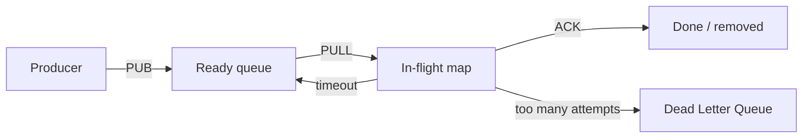
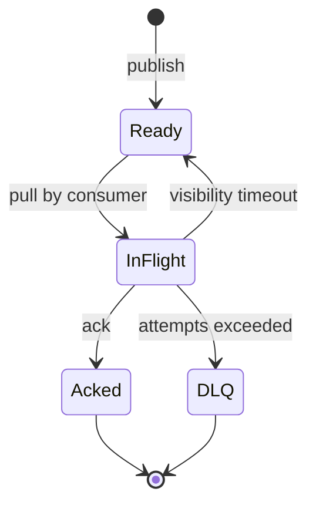
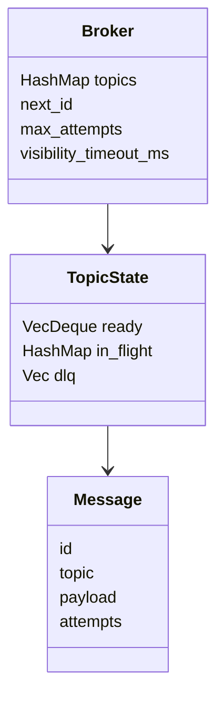

# 11 - Milestone 2: In-Memory Broker

Tujuan: membuat engine queue di memory.

---

## Visualisasi modul

Broker core adalah jantung RQueue. Di modul ini semua data masih disimpan di memory. Kalau server mati, data hilang. Nanti di modul WAL, state bisa dipulihkan.



State message:



Struktur data di memory:



Kenapa dipisah seperti ini:

- `ready` untuk message yang siap dikonsumsi.
- `in_flight` untuk message yang sudah dikirim ke consumer tapi belum di-ACK.
- `dlq` untuk message yang gagal terus.
- `next_id` untuk memberi ID unik per message.

---
## 1. Behavior awal

```txt
PUB topic payload -> message id
PULL topic group -> message atau EMPTY
ACK topic group id -> hapus dari in-flight
```

State message:

```txt
READY -> IN_FLIGHT -> ACKED
```

---

## 2. Isi `src/broker.rs`

```rust
use std::collections::{HashMap, VecDeque};
use serde::Serialize;
use thiserror::Error;

pub type MessageId = u64;

#[derive(Debug, Clone, PartialEq, Eq)]
pub struct Message {
    pub id: MessageId,
    pub topic: String,
    pub payload: String,
    pub attempts: u32,
}

impl Message {
    pub fn new(id: MessageId, topic: String, payload: String) -> Self {
        Self { id, topic, payload, attempts: 0 }
    }
}

#[derive(Debug, Clone, PartialEq, Eq)]
pub struct InFlightMessage {
    pub message: Message,
    pub group: String,
    pub delivered_at_ms: u128,
    pub deadline_ms: u128,
}

#[derive(Debug, Default)]
pub struct TopicState {
    pub ready: VecDeque<Message>,
    pub in_flight: HashMap<MessageId, InFlightMessage>,
    pub dlq: Vec<Message>,
}

#[derive(Debug)]
pub struct Broker {
    topics: HashMap<String, TopicState>,
    next_id: MessageId,
    max_attempts: u32,
    visibility_timeout_ms: u128,
}

#[derive(Debug, Error, PartialEq, Eq)]
pub enum BrokerError {
    #[error("topic not found: {0}")]
    TopicNotFound(String),

    #[error("message not found: {0}")]
    MessageNotFound(MessageId),
}

#[derive(Debug, Clone, Serialize, PartialEq, Eq)]
pub struct BrokerStats {
    pub topics: Vec<TopicStats>,
}

#[derive(Debug, Clone, Serialize, PartialEq, Eq)]
pub struct TopicStats {
    pub name: String,
    pub ready: usize,
    pub in_flight: usize,
    pub dlq: usize,
}
```

---

## 3. Helper waktu

```rust
fn now_ms() -> u128 {
    std::time::SystemTime::now()
        .duration_since(std::time::UNIX_EPOCH)
        .expect("time went backwards")
        .as_millis()
}
```

---

## 4. Implement Broker

```rust
impl Default for Broker {
    fn default() -> Self {
        Self::new()
    }
}

impl Broker {
    pub fn new() -> Self {
        Self {
            topics: HashMap::new(),
            next_id: 1,
            max_attempts: 3,
            visibility_timeout_ms: 30_000,
        }
    }

    pub fn with_config(max_attempts: u32, visibility_timeout_ms: u128) -> Self {
        Self {
            topics: HashMap::new(),
            next_id: 1,
            max_attempts,
            visibility_timeout_ms,
        }
    }

    pub fn publish(&mut self, topic: String, payload: String) -> MessageId {
        let id = self.next_id;
        self.next_id += 1;

        let message = Message::new(id, topic.clone(), payload);
        let state = self.topics.entry(topic).or_default();
        state.ready.push_back(message);

        id
    }

    pub fn pull(&mut self, topic: &str, group: &str) -> Option<Message> {
        let state = self.topics.get_mut(topic)?;
        let mut message = state.ready.pop_front()?;
        message.attempts += 1;

        let now = now_ms();
        state.in_flight.insert(message.id, InFlightMessage {
            message: message.clone(),
            group: group.to_string(),
            delivered_at_ms: now,
            deadline_ms: now + self.visibility_timeout_ms,
        });

        Some(message)
    }

    pub fn ack(&mut self, topic: &str, _group: &str, id: MessageId) -> Result<(), BrokerError> {
        let state = self
            .topics
            .get_mut(topic)
            .ok_or_else(|| BrokerError::TopicNotFound(topic.to_string()))?;

        state
            .in_flight
            .remove(&id)
            .map(|_| ())
            .ok_or(BrokerError::MessageNotFound(id))
    }

    pub fn stats(&self) -> BrokerStats {
        let mut topics = Vec::new();
        for (name, state) in &self.topics {
            topics.push(TopicStats {
                name: name.clone(),
                ready: state.ready.len(),
                in_flight: state.in_flight.len(),
                dlq: state.dlq.len(),
            });
        }
        BrokerStats { topics }
    }
}
```

---

## 5. Test broker

```rust
#[cfg(test)]
mod tests {
    use super::*;

    #[test]
    fn publish_should_generate_incrementing_id() {
        let mut broker = Broker::new();
        assert_eq!(broker.publish("payments.created".to_string(), "{}".to_string()), 1);
        assert_eq!(broker.publish("payments.created".to_string(), "{}".to_string()), 2);
    }

    #[test]
    fn pull_should_move_message_to_in_flight() {
        let mut broker = Broker::new();
        broker.publish("payments.created".to_string(), "{}".to_string());

        let message = broker.pull("payments.created", "fraud-worker").unwrap();
        assert_eq!(message.id, 1);

        let stats = broker.stats();
        assert_eq!(stats.topics[0].ready, 0);
        assert_eq!(stats.topics[0].in_flight, 1);
    }

    #[test]
    fn ack_should_remove_from_in_flight() {
        let mut broker = Broker::new();
        let id = broker.publish("payments.created".to_string(), "{}".to_string());
        broker.pull("payments.created", "fraud-worker").unwrap();
        broker.ack("payments.created", "fraud-worker", id).unwrap();

        let stats = broker.stats();
        assert_eq!(stats.topics[0].in_flight, 0);
    }
}
```

Run:

```bash
cargo test broker
```

---

## Checkpoint

Lanjut kalau:

- publish menghasilkan ID naik;
- pull memindahkan ready ke in-flight;
- ack menghapus dari in-flight;
- stats menampilkan count.
