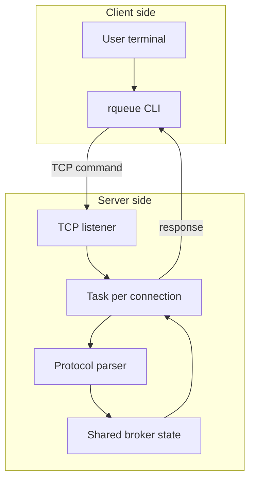
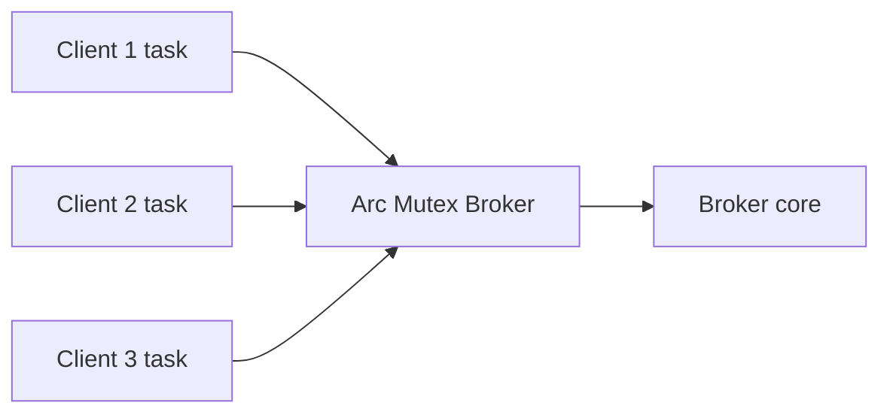
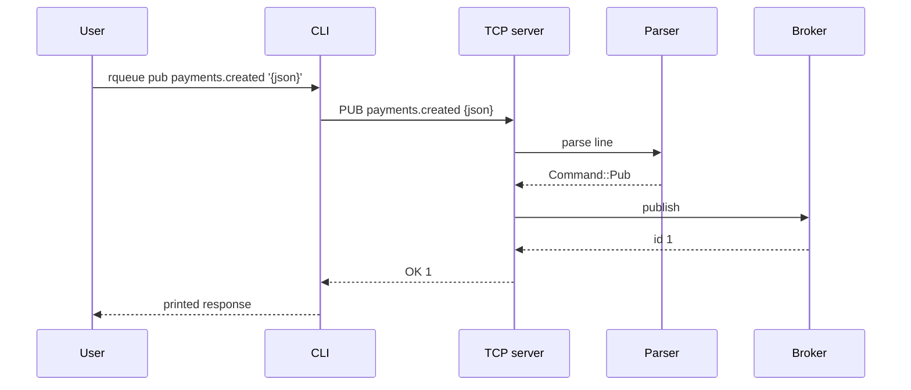

# 12 - Milestone 3: TCP Server dan CLI Client

Tujuan: menghubungkan protocol parser + broker + TCP server + CLI.

---

## Visualisasi modul

Di modul ini, parser dan broker mulai benar-benar dipakai lewat jaringan lokal. CLI mengirim command, server menerima command, parser menerjemahkan, broker memproses, lalu response dikirim balik.



Karena banyak client bisa connect bersamaan, broker harus dibungkus shared state.



Alur satu request:



---
## 1. Server flow

```txt
client connect
read line
parse command
execute broker operation
encode response
write response
```

---

## 2. `src/bin/rqueued.rs`

```rust
use std::sync::Arc;

use rqueue::broker::Broker;
use rqueue::protocol::{parse_command, Command, Response};
use tokio::io::{AsyncBufReadExt, AsyncWriteExt, BufReader};
use tokio::net::{TcpListener, TcpStream};
use tokio::sync::Mutex;
use tracing::{error, info};

#[tokio::main]
async fn main() -> Result<(), Box<dyn std::error::Error>> {
    tracing_subscriber::fmt()
        .with_env_filter("rqueue=debug,info")
        .init();

    let addr = "127.0.0.1:7379";
    let listener = TcpListener::bind(addr).await?;
    let broker = Arc::new(Mutex::new(Broker::new()));

    info!(%addr, "rqueued listening");

    loop {
        let (socket, peer_addr) = listener.accept().await?;
        let broker = broker.clone();

        tokio::spawn(async move {
            if let Err(err) = handle_client(socket, broker).await {
                error!(%peer_addr, error = %err, "client error");
            }
        });
    }
}

async fn handle_client(
    socket: TcpStream,
    broker: Arc<Mutex<Broker>>,
) -> Result<(), Box<dyn std::error::Error>> {
    let (reader, mut writer) = socket.into_split();
    let mut reader = BufReader::new(reader);
    let mut line = String::new();

    loop {
        line.clear();
        let bytes = reader.read_line(&mut line).await?;
        if bytes == 0 {
            break;
        }

        let response = handle_line(&line, broker.clone()).await;
        writer.write_all(response.encode().as_bytes()).await?;
    }

    Ok(())
}

async fn handle_line(line: &str, broker: Arc<Mutex<Broker>>) -> Response {
    let command = match parse_command(line) {
        Ok(command) => command,
        Err(err) => return Response::Error(err.to_string()),
    };

    match command {
        Command::Ping => Response::Pong,
        Command::Stats => {
            let broker = broker.lock().await;
            Response::Ok(format!("{:?}", broker.stats()))
        }
        Command::Pub { topic, payload } => {
            let mut broker = broker.lock().await;
            let id = broker.publish(topic, payload);
            Response::Ok(format!("published id={}", id))
        }
        Command::Pull { topic, group } => {
            let mut broker = broker.lock().await;
            match broker.pull(&topic, &group) {
                Some(message) => Response::Message {
                    id: message.id,
                    topic: message.topic,
                    payload: message.payload,
                },
                None => Response::Empty,
            }
        }
        Command::Ack { topic, group, id } => {
            let mut broker = broker.lock().await;
            match broker.ack(&topic, &group, id) {
                Ok(()) => Response::Ok(format!("acked id={}", id)),
                Err(err) => Response::Error(err.to_string()),
            }
        }
        Command::Nack { id, .. } => Response::Error(format!("nack not implemented yet id={}", id)),
    }
}
```

---

## 3. Test manual dengan nc

Terminal A:

```bash
cargo run --bin rqueued
```

Terminal B:

```bash
nc 127.0.0.1 7379
```

Ketik:

```txt
PING
PUB payments.created {"id":"trx_001"}
PULL payments.created fraud-worker
ACK payments.created fraud-worker 1
```

---

## 4. CLI client `src/bin/rqueue.rs`

```rust
use clap::{Parser, Subcommand};
use tokio::io::{AsyncBufReadExt, AsyncWriteExt, BufReader};
use tokio::net::TcpStream;

#[derive(Debug, Parser)]
#[command(name = "rqueue")]
struct Cli {
    #[arg(long, default_value = "127.0.0.1:7379")]
    addr: String,

    #[command(subcommand)]
    command: Commands,
}

#[derive(Debug, Subcommand)]
enum Commands {
    Ping,
    Stats,
    Pub { topic: String, payload: String },
    Pull { topic: String, group: String },
    Ack { topic: String, group: String, id: u64 },
    Nack { topic: String, group: String, id: u64 },
}

#[tokio::main]
async fn main() -> Result<(), Box<dyn std::error::Error>> {
    let cli = Cli::parse();

    if let Commands::Pub { payload, .. } = &cli.command {
        let _: serde_json::Value = serde_json::from_str(payload)?;
    }

    let line = to_protocol_line(cli.command);
    let stream = TcpStream::connect(&cli.addr).await?;
    let (reader, mut writer) = stream.into_split();
    let mut reader = BufReader::new(reader);

    writer.write_all(line.as_bytes()).await?;
    writer.write_all(b"\n").await?;

    let mut response = String::new();
    reader.read_line(&mut response).await?;
    print!("{}", response);

    Ok(())
}

fn to_protocol_line(command: Commands) -> String {
    match command {
        Commands::Ping => "PING".to_string(),
        Commands::Stats => "STATS".to_string(),
        Commands::Pub { topic, payload } => format!("PUB {} {}", topic, payload),
        Commands::Pull { topic, group } => format!("PULL {} {}", topic, group),
        Commands::Ack { topic, group, id } => format!("ACK {} {} {}", topic, group, id),
        Commands::Nack { topic, group, id } => format!("NACK {} {} {}", topic, group, id),
    }
}
```

---

## 5. Test CLI

```bash
cargo run --bin rqueue -- ping
cargo run --bin rqueue -- pub payments.created '{"id":"trx_001"}'
cargo run --bin rqueue -- pull payments.created fraud-worker
cargo run --bin rqueue -- ack payments.created fraud-worker 1
cargo run --bin rqueue -- stats
```

---

## Checkpoint

Lanjut kalau server dan CLI bisa publish, pull, dan ACK.
