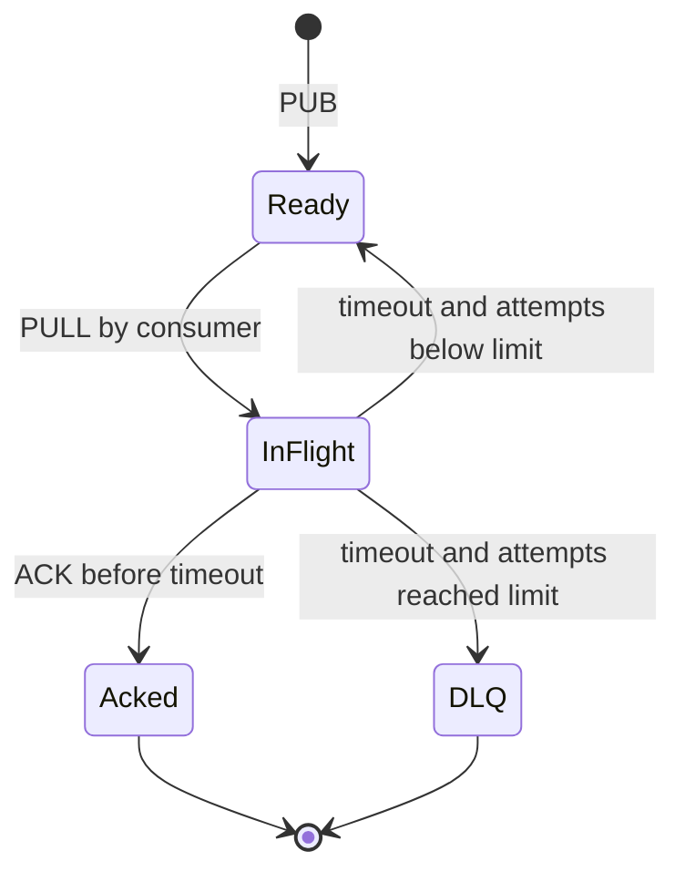
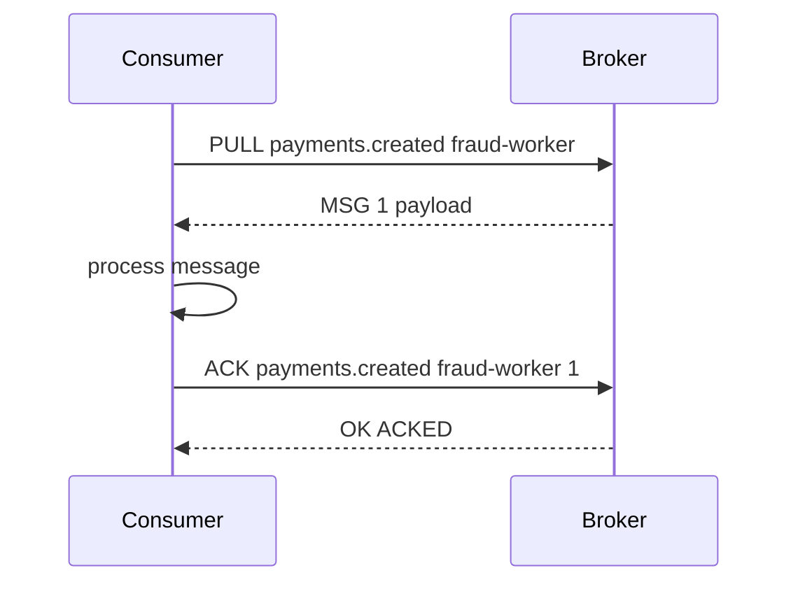
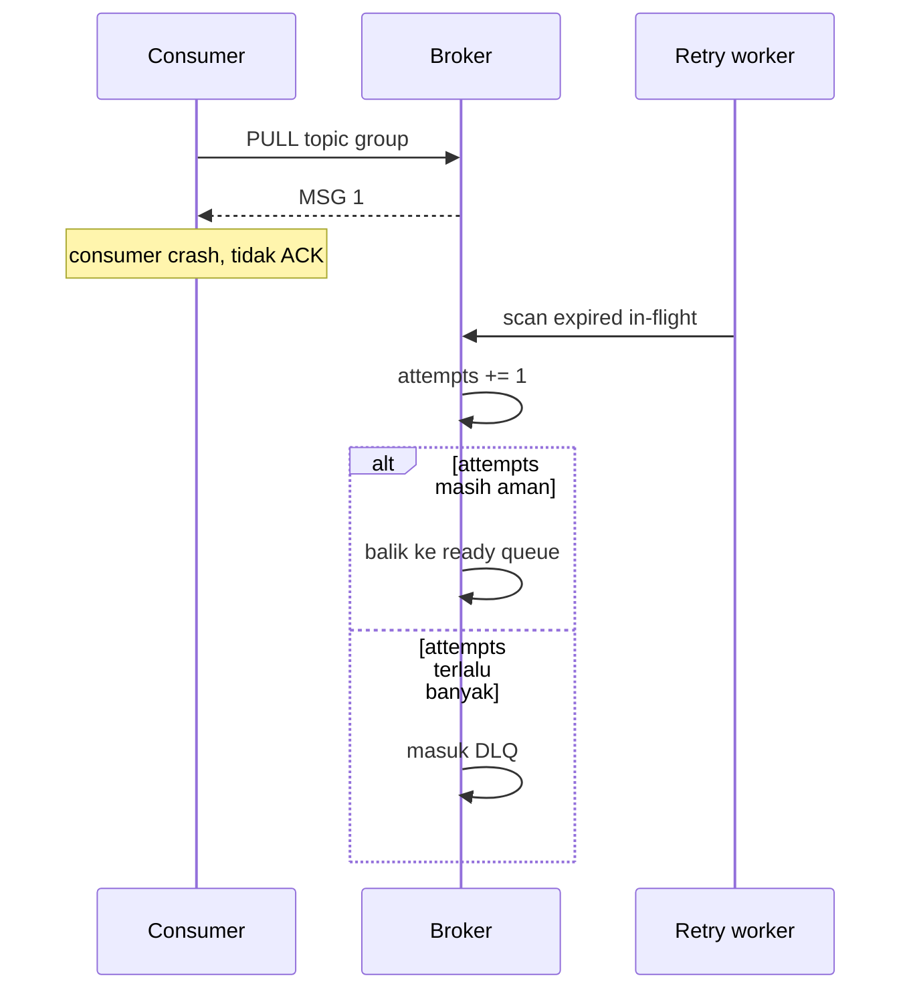

# 13 - Milestone 4: ACK, NACK, Retry, dan DLQ

Tujuan: message yang gagal diproses tidak hilang.

---

## Visualisasi modul

ACK, retry, visibility timeout, dan DLQ adalah bagian yang membuat broker terasa nyata. Tanpa ini, consumer yang crash bisa membuat message hilang.



Skenario consumer sukses:



Skenario consumer crash:



Definisi penting:

- ACK berarti consumer menyatakan message berhasil diproses.
- Visibility timeout adalah batas waktu message boleh berada di in-flight tanpa ACK.
- Retry berarti message dikembalikan ke ready queue.
- DLQ adalah tempat message gagal setelah retry maksimum.

---
## 1. Flow state

```txt
READY -> IN_FLIGHT -> ACKED
READY -> IN_FLIGHT -> READY       jika timeout/NACK dan attempts < max
READY -> IN_FLIGHT -> DEAD_LETTER jika attempts >= max
```

Kenapa perlu?

Consumer bisa crash setelah menerima message tapi sebelum ACK. Kalau broker langsung menghapus message saat pull, data hilang.

---

## 2. Tambah NACK di broker

Di `impl Broker`:

```rust
pub fn nack(&mut self, topic: &str, id: MessageId) -> Result<(), BrokerError> {
    let state = self
        .topics
        .get_mut(topic)
        .ok_or_else(|| BrokerError::TopicNotFound(topic.to_string()))?;

    let item = state
        .in_flight
        .remove(&id)
        .ok_or(BrokerError::MessageNotFound(id))?;

    if item.message.attempts >= self.max_attempts {
        state.dlq.push(item.message);
    } else {
        state.ready.push_back(item.message);
    }

    Ok(())
}
```

---

## 3. Requeue expired

Di `impl Broker`:

```rust
pub fn requeue_expired(&mut self) -> usize {
    let now = now_ms();
    let mut moved = 0;

    for state in self.topics.values_mut() {
        let expired_ids: Vec<MessageId> = state
            .in_flight
            .iter()
            .filter_map(|(id, item)| {
                if item.deadline_ms <= now {
                    Some(*id)
                } else {
                    None
                }
            })
            .collect();

        for id in expired_ids {
            if let Some(item) = state.in_flight.remove(&id) {
                if item.message.attempts >= self.max_attempts {
                    state.dlq.push(item.message);
                } else {
                    state.ready.push_back(item.message);
                }
                moved += 1;
            }
        }
    }

    moved
}
```

Kenapa `expired_ids` dikumpulkan dulu? Karena Rust tidak mengizinkan mutate `HashMap` saat sedang iterasi immutable.

---

## 4. Background retry worker

Di `rqueued.rs`, setelah broker dibuat:

```rust
let retry_broker = broker.clone();
tokio::spawn(async move {
    let mut interval = tokio::time::interval(std::time::Duration::from_secs(1));

    loop {
        interval.tick().await;
        let mut broker = retry_broker.lock().await;
        let moved = broker.requeue_expired();
        if moved > 0 {
            tracing::info!(moved, "requeued expired messages");
        }
    }
});
```

Untuk test manual, sementara pakai timeout kecil:

```rust
let broker = Arc::new(Mutex::new(Broker::with_config(2, 5_000)));
```

---

## 5. Wire NACK di server

Ganti branch `Nack` di `handle_line`:

```rust
Command::Nack { topic, group: _, id } => {
    let mut broker = broker.lock().await;
    match broker.nack(&topic, id) {
        Ok(()) => Response::Ok(format!("nacked id={}", id)),
        Err(err) => Response::Error(err.to_string()),
    }
}
```

---

## 6. Test manual retry

Terminal A:

```bash
cargo run --bin rqueued
```

Terminal B:

```bash
cargo run --bin rqueue -- pub payments.created '{"id":"trx_retry"}'
cargo run --bin rqueue -- pull payments.created fraud-worker
```

Jangan ACK. Tunggu lebih dari visibility timeout, lalu:

```bash
cargo run --bin rqueue -- pull payments.created fraud-worker
```

Message harus muncul lagi.

---

## 7. Test manual DLQ

```bash
cargo run --bin rqueue -- pub payments.created '{"id":"trx_dlq"}'
cargo run --bin rqueue -- pull payments.created fraud-worker
cargo run --bin rqueue -- nack payments.created fraud-worker 1
cargo run --bin rqueue -- pull payments.created fraud-worker
cargo run --bin rqueue -- nack payments.created fraud-worker 1
cargo run --bin rqueue -- stats
```

Kalau `max_attempts = 2`, message masuk DLQ setelah gagal dua kali.

---

## 8. Tests yang harus dibuat

```rust
#[test]
fn nack_should_requeue_when_attempts_below_max() {}

#[test]
fn nack_should_move_to_dlq_when_attempts_reach_max() {}

#[test]
fn requeue_expired_should_move_message_to_ready() {}
```

---

## Checkpoint

Lanjut kalau:

- NACK jalan;
- timeout mengembalikan message ke ready;
- attempts naik setiap pull;
- DLQ bertambah setelah attempts habis.
