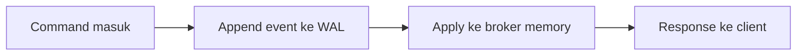
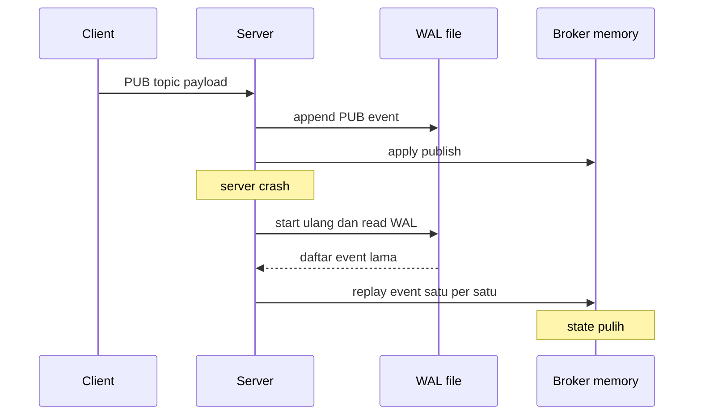
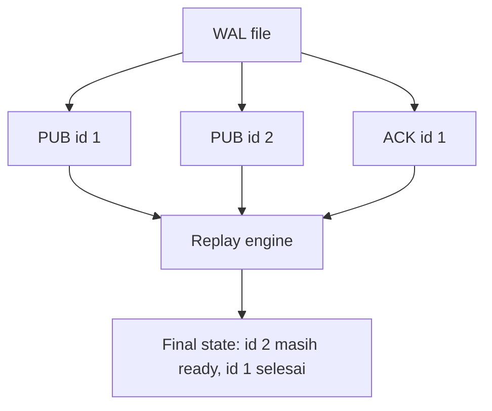

# 14 - Milestone 5: Write-Ahead Log dan Recovery

Tujuan: message tidak hilang saat broker restart.

---

## Visualisasi modul

WAL membuat broker bisa pulih setelah restart. Setiap perubahan penting ditulis dulu ke file log. Saat server nyala lagi, log dibaca ulang untuk membangun state memory.



Kalau server crash:



Replay mental model:



Kenapa urutan penting:

- WAL harus append sebelum response sukses diberikan.
- Recovery membaca event sesuai urutan penulisan.
- Event harus cukup lengkap untuk membangun ulang state.
- Test recovery harus mensimulasikan restart.

---
## 1. Kenapa WAL?

Broker in-memory hilang saat process mati. WAL mencatat event ke file supaya state bisa dibangun ulang.

Contoh WAL JSON lines:

```json
{"type":"publish","id":1,"topic":"payments.created","payload":"{}"}
{"type":"ack","id":1,"topic":"payments.created","group":"fraud-worker"}
```

---

## 2. `src/wal.rs`

```rust
use serde::{Deserialize, Serialize};
use std::path::{Path, PathBuf};
use thiserror::Error;
use tokio::fs::{File, OpenOptions};
use tokio::io::{AsyncBufReadExt, AsyncWriteExt, BufReader};

#[derive(Debug, Clone, Serialize, Deserialize, PartialEq, Eq)]
#[serde(tag = "type")]
pub enum WalEvent {
    Publish { id: u64, topic: String, payload: String },
    Pull { id: u64, topic: String, group: String },
    Ack { id: u64, topic: String, group: String },
    Nack { id: u64, topic: String, group: String },
}

#[derive(Debug, Error)]
pub enum WalError {
    #[error("io error: {0}")]
    Io(#[from] std::io::Error),

    #[error("json error: {0}")]
    Json(#[from] serde_json::Error),
}

pub struct Wal {
    file: File,
    path: PathBuf,
}

impl Wal {
    pub async fn open(path: impl AsRef<Path>) -> Result<Self, WalError> {
        let path = path.as_ref().to_path_buf();

        if let Some(parent) = path.parent() {
            tokio::fs::create_dir_all(parent).await?;
        }

        let file = OpenOptions::new()
            .create(true)
            .append(true)
            .open(&path)
            .await?;

        Ok(Self { file, path })
    }

    pub async fn append(&mut self, event: &WalEvent) -> Result<(), WalError> {
        let line = serde_json::to_string(event)?;
        self.file.write_all(line.as_bytes()).await?;
        self.file.write_all(b"\n").await?;
        self.file.flush().await?;
        Ok(())
    }

    pub fn path(&self) -> &Path {
        &self.path
    }
}

pub async fn read_events(path: impl AsRef<Path>) -> Result<Vec<WalEvent>, WalError> {
    let path = path.as_ref();
    if !path.exists() {
        return Ok(Vec::new());
    }

    let file = File::open(path).await?;
    let reader = BufReader::new(file);
    let mut lines = reader.lines();
    let mut events = Vec::new();

    while let Some(line) = lines.next_line().await? {
        if line.trim().is_empty() {
            continue;
        }
        let event = serde_json::from_str::<WalEvent>(&line)?;
        events.push(event);
    }

    Ok(events)
}
```

---

## 3. Recovery method di broker

Tambahkan method sederhana:

```rust
pub fn insert_recovered_message(&mut self, id: MessageId, topic: String, payload: String) {
    self.next_id = self.next_id.max(id + 1);
    let message = Message::new(id, topic.clone(), payload);
    self.topics.entry(topic).or_default().ready.push_back(message);
}

pub fn recover_ack(&mut self, topic: &str, id: MessageId) {
    if let Some(state) = self.topics.get_mut(topic) {
        state.in_flight.remove(&id);
        if let Some(pos) = state.ready.iter().position(|message| message.id == id) {
            state.ready.remove(pos);
        }
    }
}
```

Recovery awal cukup:

- replay `Publish` sebagai ready message;
- replay `Ack` menghapus message;
- in-flight saat crash dianggap ready lagi.

---

## 4. Rebuild broker dari WAL

Di `wal.rs`:

```rust
use crate::broker::Broker;

pub fn rebuild_broker(events: Vec<WalEvent>) -> Broker {
    let mut broker = Broker::new();

    for event in events {
        match event {
            WalEvent::Publish { id, topic, payload } => {
                broker.insert_recovered_message(id, topic, payload);
            }
            WalEvent::Ack { id, topic, group: _ } => {
                broker.recover_ack(&topic, id);
            }
            WalEvent::Pull { .. } => {}
            WalEvent::Nack { .. } => {}
        }
    }

    broker
}
```

Catatan: ini recovery sederhana. Nanti bisa dibuat lebih akurat dengan mencatat state pull/nack dan attempts.

---

## 5. Integrasi saat startup

Di `rqueued.rs`:

```rust
let wal_path = "./data/rqueue.wal";
let events = rqueue::wal::read_events(wal_path).await?;
let recovered_broker = rqueue::wal::rebuild_broker(events);
let broker = Arc::new(Mutex::new(recovered_broker));
let wal = Arc::new(Mutex::new(rqueue::wal::Wal::open(wal_path).await?));
```

Ubah `handle_line` agar menerima `wal`.

Saat publish:

```rust
let id = {
    let mut broker = broker.lock().await;
    broker.publish(topic.clone(), payload.clone())
};

let event = rqueue::wal::WalEvent::Publish { id, topic, payload };
if let Err(err) = wal.lock().await.append(&event).await {
    return Response::Error(err.to_string());
}

Response::Ok(format!("published id={}", id))
```

Saat ACK:

```rust
let result = {
    let mut broker = broker.lock().await;
    broker.ack(&topic, &group, id)
};

match result {
    Ok(()) => {
        let event = rqueue::wal::WalEvent::Ack { id, topic, group };
        if let Err(err) = wal.lock().await.append(&event).await {
            return Response::Error(err.to_string());
        }
        Response::Ok(format!("acked id={}", id))
    }
    Err(err) => Response::Error(err.to_string()),
}
```

---

## 6. Test recovery manual

1. Start server.
2. Publish message.
3. Stop server.
4. Start server lagi.
5. Pull message.

```bash
cargo run --bin rqueue -- pub payments.created '{"id":"recover_me"}'
# Ctrl+C server
cargo run --bin rqueued
cargo run --bin rqueue -- pull payments.created recovery-worker
```

---

## 7. Limitation yang wajib ditulis

RQueue versi ini:

- belum punya WAL compaction;
- belum punya snapshot;
- belum sempurna untuk event NACK/retry;
- belum memakai fsync kuat;
- masih at-least-once.

Itu tidak apa-apa untuk project belajar, asal ditulis jujur.

---

## Checkpoint

Lanjut kalau publish tetap ada setelah restart.
