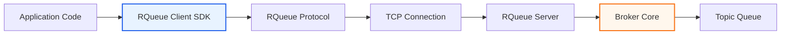
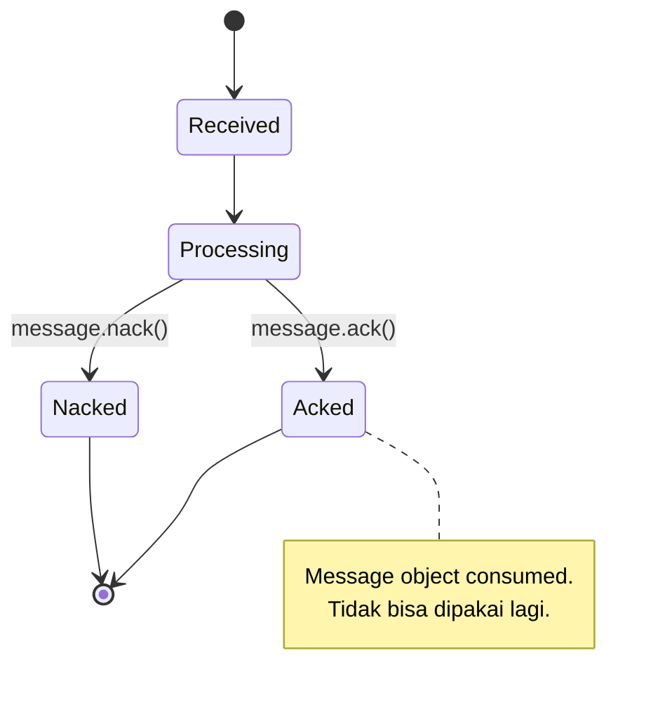
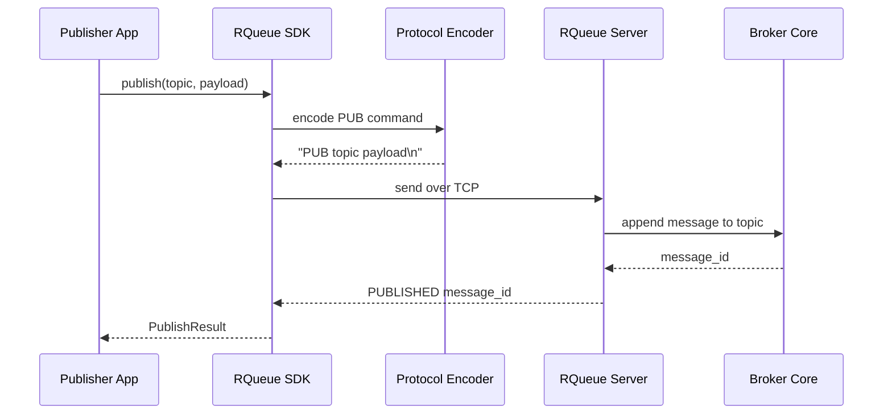
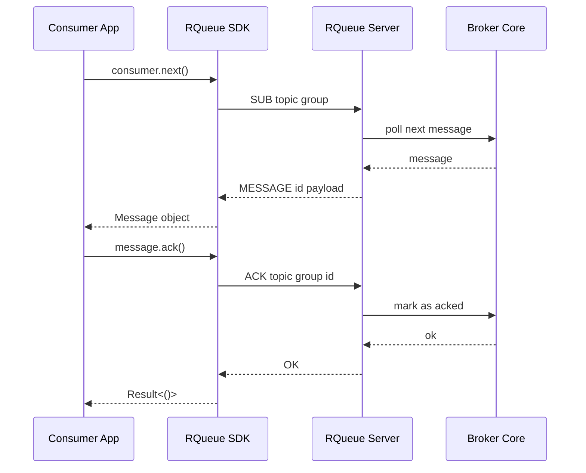
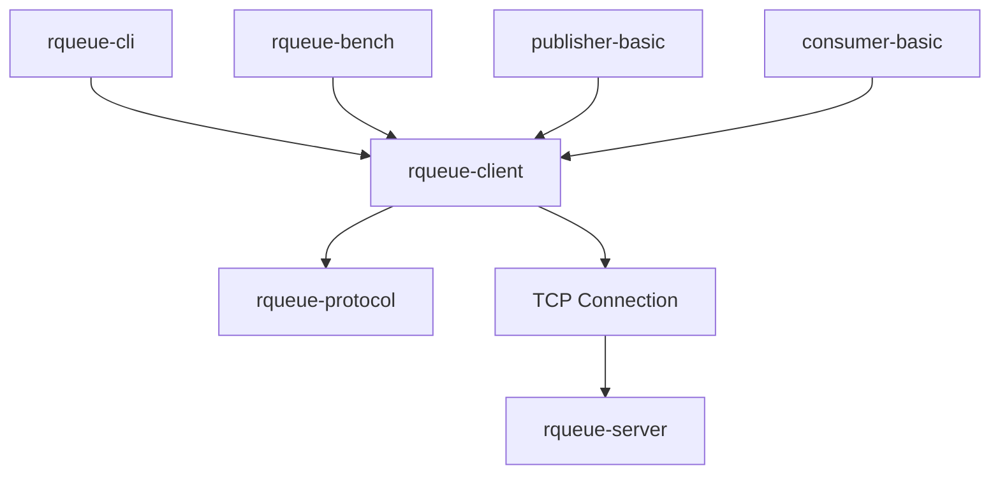

# Modul 15 — Client SDK untuk Publisher dan Consumer

Modul ini adalah titik penting dalam project.

Sampai modul sebelumnya, RQueue sudah punya broker server dan reliability feature. Sekarang kita membuat **Client SDK** supaya aplikasi lain bisa memakai broker dengan API Rust yang nyaman, bukan raw TCP command manual.

Admin API tetap penting untuk debugging dan observability, tapi SDK adalah product surface utama message broker.

---

## Tujuan modul

Di akhir modul ini, kamu akan punya crate:

```text
crates/rqueue-client
```

yang bisa dipakai aplikasi Rust lain untuk:

1. connect ke RQueue server,
2. publish message,
3. subscribe message,
4. menerima message sebagai object Rust,
5. melakukan `ack()`,
6. melakukan `nack()`,
7. publish payload JSON,
8. menangani error dengan rapi.

Contoh target akhir:

```rust
use rqueue_client::RQueueClient;

#[tokio::main]
async fn main() -> anyhow::Result<()> {
    let client = RQueueClient::connect("127.0.0.1:7379").await?;

    client
        .publish("payments.created", r#"{"id":"trx_001","amount":150000}"#)
        .await?;

    Ok(())
}
```

Consumer:

```rust
use rqueue_client::RQueueClient;

#[tokio::main]
async fn main() -> anyhow::Result<()> {
    let client = RQueueClient::connect("127.0.0.1:7379").await?;

    let mut consumer = client
        .subscribe("payments.created", "fraud-worker")
        .await?;

    while let Some(message) = consumer.next().await? {
        println!("received: {}", message.payload_as_string()?);

        message.ack().await?;
    }

    Ok(())
}
```

---

## Kenapa SDK lebih penting daripada Admin API?

Admin API menjawab pertanyaan operator:

```text
Broker sehat atau tidak?
Ada berapa topic?
DLQ isinya apa?
Throughput berapa?
```

SDK menjawab pertanyaan developer:

```text
Bagaimana aplikasi saya publish event?
Bagaimana worker saya consume event?
Bagaimana ACK?
Bagaimana retry?
Bagaimana handle error?
```

Message broker dipakai oleh aplikasi. Maka API yang paling penting adalah API yang dipakai aplikasi.

---

## Visualisasi modul



SDK berada di antara aplikasi dan protocol. Aplikasi tidak perlu tahu detail raw command seperti:

```text
PUB payments.created {...}
ACK payments.created msg_001
```

Aplikasi cukup memanggil function Rust:

```rust
client.publish("payments.created", payload).await?;
message.ack().await?;
```

---

## Bentuk workspace setelah modul ini

Sebelumnya project bisa saja masih sederhana:

```text
rqueue/
├── Cargo.toml
└── src/
    └── main.rs
```

Sekarang kita naikkan jadi Rust workspace:

```text
rqueue/
├── Cargo.toml
├── crates/
│   ├── rqueue-core/
│   │   └── src/lib.rs
│   ├── rqueue-protocol/
│   │   └── src/lib.rs
│   ├── rqueue-server/
│   │   └── src/main.rs
│   ├── rqueue-client/
│   │   └── src/lib.rs
│   ├── rqueue-cli/
│   │   └── src/main.rs
│   └── rqueue-bench/
│       └── src/main.rs
└── examples/
    ├── publisher-basic/
    ├── consumer-basic/
    └── retry-dlq-demo/
```

Peran tiap crate:

| Crate | Tanggung jawab |
|---|---|
| `rqueue-core` | logic broker: topic, queue, ACK, retry, DLQ |
| `rqueue-protocol` | parse dan encode command/response |
| `rqueue-server` | TCP server dan integrasi ke broker core |
| `rqueue-client` | SDK publisher/consumer |
| `rqueue-cli` | command line tool, memakai SDK |
| `rqueue-bench` | benchmark tool, memakai SDK |

---

## Step 1 — Ubah root `Cargo.toml` menjadi workspace

File:

```text
Cargo.toml
```

Isi:

```toml
[workspace]
resolver = "2"
members = [
    "crates/rqueue-core",
    "crates/rqueue-protocol",
    "crates/rqueue-server",
    "crates/rqueue-client",
    "crates/rqueue-cli",
    "crates/rqueue-bench",
]
```

Kenapa workspace?

Karena kita ingin memecah project besar menjadi beberapa crate kecil yang punya tanggung jawab jelas.

Ini mirip cara berpikir modular backend:

```text
domain logic ≠ transport logic ≠ client library ≠ CLI
```

---

## Step 2 — Buat crate `rqueue-protocol`

Command:

```bash
mkdir -p crates
cargo new crates/rqueue-protocol --lib
```

File:

```text
crates/rqueue-protocol/Cargo.toml
```

Isi minimal:

```toml
[package]
name = "rqueue-protocol"
version = "0.1.0"
edition = "2021"

[dependencies]
thiserror = "1"
```

File:

```text
crates/rqueue-protocol/src/lib.rs
```

Contoh awal:

```rust
use std::str::FromStr;

#[derive(Debug, Clone, PartialEq, Eq)]
pub enum Command {
    Pub {
        topic: String,
        payload: String,
    },
    Sub {
        topic: String,
        group: String,
    },
    Ack {
        topic: String,
        group: String,
        message_id: String,
    },
    Nack {
        topic: String,
        group: String,
        message_id: String,
    },
    Ping,
}

#[derive(Debug, Clone, PartialEq, Eq)]
pub enum Response {
    Ok,
    Published {
        message_id: String,
    },
    Message {
        topic: String,
        group: String,
        message_id: String,
        payload: String,
    },
    Empty,
    Error {
        message: String,
    },
}

#[derive(Debug, thiserror::Error)]
pub enum ProtocolError {
    #[error("empty command")]
    Empty,

    #[error("unknown command: {0}")]
    UnknownCommand(String),

    #[error("invalid command format: {0}")]
    InvalidFormat(String),
}

impl FromStr for Command {
    type Err = ProtocolError;

    fn from_str(line: &str) -> Result<Self, Self::Err> {
        let line = line.trim();

        if line.is_empty() {
            return Err(ProtocolError::Empty);
        }

        let parts: Vec<&str> = line.splitn(3, ' ').collect();

        match parts[0].to_uppercase().as_str() {
            "PING" => Ok(Command::Ping),

            "PUB" => {
                if parts.len() != 3 {
                    return Err(ProtocolError::InvalidFormat(line.to_string()));
                }

                Ok(Command::Pub {
                    topic: parts[1].to_string(),
                    payload: parts[2].to_string(),
                })
            }

            "SUB" => {
                let parts: Vec<&str> = line.split_whitespace().collect();

                if parts.len() != 3 {
                    return Err(ProtocolError::InvalidFormat(line.to_string()));
                }

                Ok(Command::Sub {
                    topic: parts[1].to_string(),
                    group: parts[2].to_string(),
                })
            }

            "ACK" => {
                let parts: Vec<&str> = line.split_whitespace().collect();

                if parts.len() != 4 {
                    return Err(ProtocolError::InvalidFormat(line.to_string()));
                }

                Ok(Command::Ack {
                    topic: parts[1].to_string(),
                    group: parts[2].to_string(),
                    message_id: parts[3].to_string(),
                })
            }

            "NACK" => {
                let parts: Vec<&str> = line.split_whitespace().collect();

                if parts.len() != 4 {
                    return Err(ProtocolError::InvalidFormat(line.to_string()));
                }

                Ok(Command::Nack {
                    topic: parts[1].to_string(),
                    group: parts[2].to_string(),
                    message_id: parts[3].to_string(),
                })
            }

            other => Err(ProtocolError::UnknownCommand(other.to_string())),
        }
    }
}

impl Response {
    pub fn encode(&self) -> String {
        match self {
            Response::Ok => "OK\n".to_string(),

            Response::Published { message_id } => {
                format!("PUBLISHED {}\n", message_id)
            }

            Response::Message {
                topic,
                group,
                message_id,
                payload,
            } => {
                format!("MESSAGE {} {} {} {}\n", topic, group, message_id, payload)
            }

            Response::Empty => "EMPTY\n".to_string(),

            Response::Error { message } => {
                format!("ERROR {}\n", message)
            }
        }
    }

    pub fn decode(line: &str) -> Result<Self, ProtocolError> {
        let line = line.trim();

        if line == "OK" {
            return Ok(Response::Ok);
        }

        if line == "EMPTY" {
            return Ok(Response::Empty);
        }

        let parts: Vec<&str> = line.splitn(5, ' ').collect();

        match parts.first().copied() {
            Some("PUBLISHED") => {
                if parts.len() != 2 {
                    return Err(ProtocolError::InvalidFormat(line.to_string()));
                }

                Ok(Response::Published {
                    message_id: parts[1].to_string(),
                })
            }

            Some("MESSAGE") => {
                if parts.len() != 5 {
                    return Err(ProtocolError::InvalidFormat(line.to_string()));
                }

                Ok(Response::Message {
                    topic: parts[1].to_string(),
                    group: parts[2].to_string(),
                    message_id: parts[3].to_string(),
                    payload: parts[4].to_string(),
                })
            }

            Some("ERROR") => {
                let message = line.strip_prefix("ERROR ").unwrap_or("").to_string();

                Ok(Response::Error { message })
            }

            Some(other) => Err(ProtocolError::UnknownCommand(other.to_string())),

            None => Err(ProtocolError::Empty),
        }
    }
}

#[cfg(test)]
mod tests {
    use super::*;

    #[test]
    fn parse_pub_command() {
        let command: Command = r#"PUB payments.created {"id":"1"}"#.parse().unwrap();

        assert_eq!(
            command,
            Command::Pub {
                topic: "payments.created".to_string(),
                payload: r#"{"id":"1"}"#.to_string()
            }
        );
    }

    #[test]
    fn encode_published_response() {
        let response = Response::Published {
            message_id: "msg_1".to_string(),
        };

        assert_eq!(response.encode(), "PUBLISHED msg_1\n");
    }

    #[test]
    fn decode_message_response() {
        let response = Response::decode(
            r#"MESSAGE payments.created fraud-worker msg_1 {"id":"1"}"#
        )
        .unwrap();

        assert_eq!(
            response,
            Response::Message {
                topic: "payments.created".to_string(),
                group: "fraud-worker".to_string(),
                message_id: "msg_1".to_string(),
                payload: r#"{"id":"1"}"#.to_string(),
            }
        );
    }
}
```

Jalankan:

```bash
cargo test -p rqueue-protocol
```

Expected output:

```text
test result: ok
```

---

## Step 3 — Buat crate `rqueue-client`

Command:

```bash
cargo new crates/rqueue-client --lib
```

File:

```text
crates/rqueue-client/Cargo.toml
```

Isi:

```toml
[package]
name = "rqueue-client"
version = "0.1.0"
edition = "2021"

[dependencies]
rqueue-protocol = { path = "../rqueue-protocol" }

tokio = { version = "1", features = ["full"] }
thiserror = "1"
serde = { version = "1", features = ["derive"] }
serde_json = "1"
```

---

## Step 4 — Design error SDK

File:

```text
crates/rqueue-client/src/error.rs
```

Isi:

```rust
#[derive(Debug, thiserror::Error)]
pub enum RQueueError {
    #[error("io error: {0}")]
    Io(#[from] std::io::Error),

    #[error("protocol error: {0}")]
    Protocol(#[from] rqueue_protocol::ProtocolError),

    #[error("server error: {0}")]
    Server(String),

    #[error("unexpected response: {0}")]
    UnexpectedResponse(String),

    #[error("json serialization error: {0}")]
    Json(#[from] serde_json::Error),
}

pub type Result<T> = std::result::Result<T, RQueueError>;
```

Kenapa error dipisah?

Supaya public API SDK enak:

```rust
client.publish("topic", "payload").await?;
```

Caller tidak perlu tahu semua detail error internal.

---

## Step 5 — Design client object

File:

```text
crates/rqueue-client/src/lib.rs
```

Isi:

```rust
mod error;

pub use error::{RQueueError, Result};

use rqueue_protocol::{Command, Response};
use serde::Serialize;
use tokio::io::{AsyncBufReadExt, AsyncWriteExt, BufReader};
use tokio::net::TcpStream;

pub struct RQueueClient {
    addr: String,
}

impl RQueueClient {
    pub async fn connect(addr: impl Into<String>) -> Result<Self> {
        let addr = addr.into();

        let stream = TcpStream::connect(&addr).await?;
        drop(stream);

        Ok(Self { addr })
    }

    pub async fn publish(&self, topic: &str, payload: impl AsRef<str>) -> Result<PublishResult> {
        let command = Command::Pub {
            topic: topic.to_string(),
            payload: payload.as_ref().to_string(),
        };

        let response = self.send_command(command).await?;

        match response {
            Response::Published { message_id } => Ok(PublishResult { message_id }),

            Response::Error { message } => Err(RQueueError::Server(message)),

            other => Err(RQueueError::UnexpectedResponse(format!("{other:?}"))),
        }
    }

    pub async fn publish_json<T>(&self, topic: &str, payload: &T) -> Result<PublishResult>
    where
        T: Serialize,
    {
        let json = serde_json::to_string(payload)?;
        self.publish(topic, json).await
    }

    pub async fn subscribe(&self, topic: &str, group: &str) -> Result<Consumer> {
        Ok(Consumer {
            addr: self.addr.clone(),
            topic: topic.to_string(),
            group: group.to_string(),
        })
    }

    async fn send_command(&self, command: Command) -> Result<Response> {
        let mut stream = TcpStream::connect(&self.addr).await?;

        let line = encode_command(command);
        stream.write_all(line.as_bytes()).await?;
        stream.flush().await?;

        let mut reader = BufReader::new(stream);
        let mut response_line = String::new();
        reader.read_line(&mut response_line).await?;

        let response = Response::decode(&response_line)?;
        Ok(response)
    }
}

#[derive(Debug, Clone)]
pub struct PublishResult {
    pub message_id: String,
}

pub struct Consumer {
    addr: String,
    topic: String,
    group: String,
}

impl Consumer {
    pub async fn next(&mut self) -> Result<Option<Message>> {
        let command = Command::Sub {
            topic: self.topic.clone(),
            group: self.group.clone(),
        };

        let response = send_command_to_addr(&self.addr, command).await?;

        match response {
            Response::Message {
                topic,
                group,
                message_id,
                payload,
            } => {
                let ack_handle = AckHandle {
                    addr: self.addr.clone(),
                    topic: topic.clone(),
                    group: group.clone(),
                };

                Ok(Some(Message {
                    id: message_id,
                    topic,
                    group,
                    payload,
                    ack_handle,
                }))
            }

            Response::Empty => Ok(None),

            Response::Error { message } => Err(RQueueError::Server(message)),

            other => Err(RQueueError::UnexpectedResponse(format!("{other:?}"))),
        }
    }
}

pub struct Message {
    pub id: String,
    pub topic: String,
    pub group: String,
    payload: String,
    ack_handle: AckHandle,
}

impl Message {
    pub fn payload(&self) -> &str {
        &self.payload
    }

    pub fn payload_as_string(&self) -> Result<String> {
        Ok(self.payload.clone())
    }

    pub async fn ack(self) -> Result<()> {
        self.ack_handle.ack(&self.id).await
    }

    pub async fn nack(self) -> Result<()> {
        self.ack_handle.nack(&self.id).await
    }
}

#[derive(Clone)]
struct AckHandle {
    addr: String,
    topic: String,
    group: String,
}

impl AckHandle {
    async fn ack(&self, message_id: &str) -> Result<()> {
        let command = Command::Ack {
            topic: self.topic.clone(),
            group: self.group.clone(),
            message_id: message_id.to_string(),
        };

        expect_ok(send_command_to_addr(&self.addr, command).await?)
    }

    async fn nack(&self, message_id: &str) -> Result<()> {
        let command = Command::Nack {
            topic: self.topic.clone(),
            group: self.group.clone(),
            message_id: message_id.to_string(),
        };

        expect_ok(send_command_to_addr(&self.addr, command).await?)
    }
}

async fn send_command_to_addr(addr: &str, command: Command) -> Result<Response> {
    let mut stream = TcpStream::connect(addr).await?;

    let line = encode_command(command);
    stream.write_all(line.as_bytes()).await?;
    stream.flush().await?;

    let mut reader = BufReader::new(stream);
    let mut response_line = String::new();
    reader.read_line(&mut response_line).await?;

    Ok(Response::decode(&response_line)?)
}

fn expect_ok(response: Response) -> Result<()> {
    match response {
        Response::Ok => Ok(()),

        Response::Error { message } => Err(RQueueError::Server(message)),

        other => Err(RQueueError::UnexpectedResponse(format!("{other:?}"))),
    }
}

fn encode_command(command: Command) -> String {
    match command {
        Command::Pub { topic, payload } => {
            format!("PUB {topic} {payload}\n")
        }

        Command::Sub { topic, group } => {
            format!("SUB {topic} {group}\n")
        }

        Command::Ack {
            topic,
            group,
            message_id,
        } => {
            format!("ACK {topic} {group} {message_id}\n")
        }

        Command::Nack {
            topic,
            group,
            message_id,
        } => {
            format!("NACK {topic} {group} {message_id}\n")
        }

        Command::Ping => "PING\n".to_string(),
    }
}
```

---

## Kenapa `ack(self)` bukan `ack(&self)`?

Perhatikan:

```rust
pub async fn ack(self) -> Result<()> {
    self.ack_handle.ack(&self.id).await
}
```

Method ini menerima `self`, bukan `&self`.

Artinya setelah message di-ACK, object `message` dianggap sudah dipakai dan tidak bisa dipakai lagi.

Contoh:

```rust
message.ack().await?;
message.ack().await?;
```

Baris kedua akan gagal compile karena `message` sudah moved.

Ini bagus, karena secara domain:

```text
Message yang sudah selesai diproses tidak boleh di-ACK dua kali.
```

Rust membantu mencegah bug state transition lewat ownership.

Visualisasi:



---

## Step 6 — Buat example publisher

Folder:

```text
examples/publisher-basic
```

Command:

```bash
mkdir -p examples/publisher-basic/src
```

File:

```text
examples/publisher-basic/Cargo.toml
```

Isi:

```toml
[package]
name = "publisher-basic"
version = "0.1.0"
edition = "2021"

[dependencies]
rqueue-client = { path = "../../crates/rqueue-client" }
tokio = { version = "1", features = ["full"] }
anyhow = "1"
```

File:

```text
examples/publisher-basic/src/main.rs
```

Isi:

```rust
use rqueue_client::RQueueClient;

#[tokio::main]
async fn main() -> anyhow::Result<()> {
    let client = RQueueClient::connect("127.0.0.1:7379").await?;

    let result = client
        .publish("payments.created", r#"{"id":"trx_001","amount":150000}"#)
        .await?;

    println!("published message_id={}", result.message_id);

    Ok(())
}
```

---

## Step 7 — Buat example consumer

Folder:

```text
examples/consumer-basic
```

Command:

```bash
mkdir -p examples/consumer-basic/src
```

File:

```text
examples/consumer-basic/Cargo.toml
```

Isi:

```toml
[package]
name = "consumer-basic"
version = "0.1.0"
edition = "2021"

[dependencies]
rqueue-client = { path = "../../crates/rqueue-client" }
tokio = { version = "1", features = ["full"] }
anyhow = "1"
```

File:

```text
examples/consumer-basic/src/main.rs
```

Isi:

```rust
use rqueue_client::RQueueClient;

#[tokio::main]
async fn main() -> anyhow::Result<()> {
    let client = RQueueClient::connect("127.0.0.1:7379").await?;

    let mut consumer = client
        .subscribe("payments.created", "fraud-worker")
        .await?;

    loop {
        match consumer.next().await? {
            Some(message) => {
                println!("received id={} payload={}", message.id, message.payload());

                message.ack().await?;
            }

            None => {
                println!("no message available");
                tokio::time::sleep(std::time::Duration::from_secs(1)).await;
            }
        }
    }
}
```

---

## Step 8 — Flow publisher dengan SDK



---

## Step 9 — Flow consumer dengan SDK



---

## Step 10 — CLI harus memakai SDK

Sebelumnya CLI mungkin encode TCP command sendiri.

Itu boleh di awal belajar, tapi setelah ada SDK, CLI harus diubah.

Arsitektur yang benar:



Alasannya:

1. SDK benar-benar teruji oleh CLI.
2. Tidak ada duplikasi logic protocol.
3. Kalau protocol berubah, update cukup di SDK/protocol crate.
4. Benchmark memakai surface yang sama dengan real application.

---

## Step 11 — Update `rqueue-cli` supaya pakai SDK

Contoh command:

```bash
rqueue pub payments.created '{"id":"trx_001"}'
rqueue sub payments.created fraud-worker
```

Pseudo implementation:

```rust
use clap::{Parser, Subcommand};
use rqueue_client::RQueueClient;

#[derive(Parser)]
struct Cli {
    #[arg(long, default_value = "127.0.0.1:7379")]
    addr: String,

    #[command(subcommand)]
    command: Commands,
}

#[derive(Subcommand)]
enum Commands {
    Pub {
        topic: String,
        payload: String,
    },
    Sub {
        topic: String,
        group: String,
    },
}

#[tokio::main]
async fn main() -> anyhow::Result<()> {
    let cli = Cli::parse();
    let client = RQueueClient::connect(cli.addr).await?;

    match cli.command {
        Commands::Pub { topic, payload } => {
            let result = client.publish(&topic, payload).await?;
            println!("published {}", result.message_id);
        }

        Commands::Sub { topic, group } => {
            let mut consumer = client.subscribe(&topic, &group).await?;

            loop {
                match consumer.next().await? {
                    Some(message) => {
                        println!("{} {}", message.id, message.payload());
                        message.ack().await?;
                    }

                    None => {
                        tokio::time::sleep(std::time::Duration::from_secs(1)).await;
                    }
                }
            }
        }
    }

    Ok(())
}
```

---

## Checklist modul

Sebelum lanjut, pastikan:

- [ ] `rqueue-protocol` punya `Command` dan `Response`.
- [ ] `rqueue-protocol` punya unit test untuk parse/encode/decode.
- [ ] `rqueue-client` punya `RQueueClient::connect`.
- [ ] `rqueue-client` punya `publish`.
- [ ] `rqueue-client` punya `publish_json`.
- [ ] `rqueue-client` punya `subscribe`.
- [ ] `Consumer` punya `next`.
- [ ] `Message` punya `ack(self)`.
- [ ] `Message` punya `nack(self)`.
- [ ] Ada `examples/publisher-basic`.
- [ ] Ada `examples/consumer-basic`.
- [ ] CLI mulai diarahkan memakai SDK.
- [ ] Tidak ada logic protocol yang diduplikasi di CLI.

---

## Latihan

### Latihan 1 — Tambah `ping`

Tambahkan API:

```rust
client.ping().await?;
```

Expected behavior:

```text
PING -> OK
```

### Latihan 2 — Tambah timeout

Tambahkan:

```rust
RQueueClient::connect_with_timeout(addr, Duration::from_secs(3)).await?;
```

### Latihan 3 — Tambah consumer builder

Target API:

```rust
let mut consumer = client
    .consumer("payments.created")
    .group("fraud-worker")
    .subscribe()
    .await?;
```

### Latihan 4 — Tambah deserialize JSON

Target API:

```rust
let event: PaymentCreated = message.json()?;
```

Signature:

```rust
impl Message {
    pub fn json<T>(&self) -> Result<T>
    where
        T: serde::de::DeserializeOwned,
    {
        Ok(serde_json::from_str(&self.payload)?)
    }
}
```

### Latihan 5 — ACK harus idempotent di server

Walaupun SDK mencegah double ACK di sisi compile-time untuk object yang sama, server tetap harus aman.

Kenapa?

Karena client bisa reconnect, retry, atau mengirim raw command manual.

---

## Kesalahan umum

### 1. CLI masih encode raw TCP sendiri

Salah:

```text
rqueue-cli -> TCP langsung
```

Benar:

```text
rqueue-cli -> rqueue-client -> TCP
```

### 2. SDK terlalu tahu isi broker core

SDK tidak boleh import `rqueue-core`.

SDK hanya boleh tahu:

```text
protocol
tcp
request/response
public API
```

### 3. `ack(&self)` membuat double ACK mudah terjadi

Untuk belajar ownership Rust, pakai:

```rust
ack(self)
```

bukan:

```rust
ack(&self)
```

### 4. Error pakai string semua

Hindari:

```rust
Result<T, String>
```

Pakai custom error:

```rust
RQueueError
```

---

## Ringkasan

Modul ini mengubah RQueue dari:

```text
server yang bisa dites manual
```

menjadi:

```text
mini message broker ecosystem yang bisa dipakai aplikasi Rust lain
```

Final shape yang kita kejar:

```text
rqueue-server
rqueue-client
rqueue-cli
rqueue-bench
examples
docs
```

Admin API tetap boleh dibuat, tapi bukan pusat produk.

Pusat produk message broker adalah:

```text
publisher SDK
consumer SDK
delivery semantics
reliability
benchmark
```
