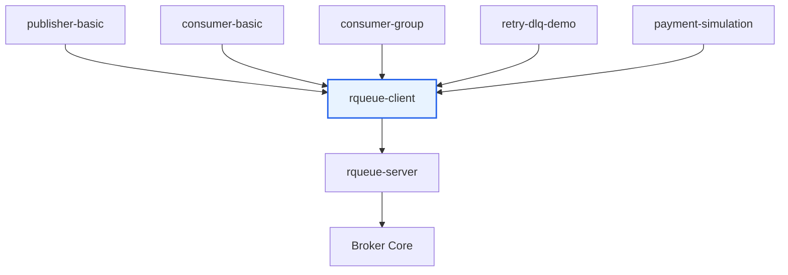
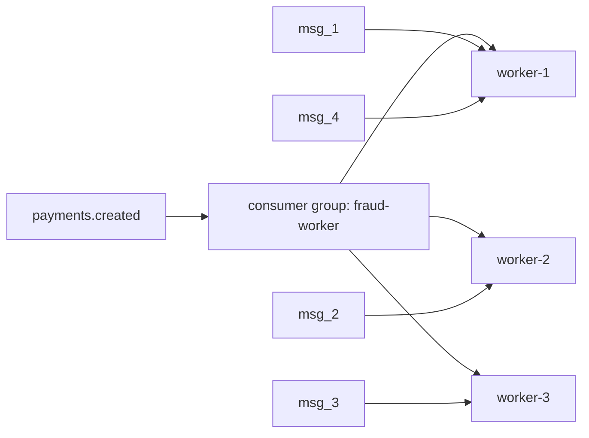
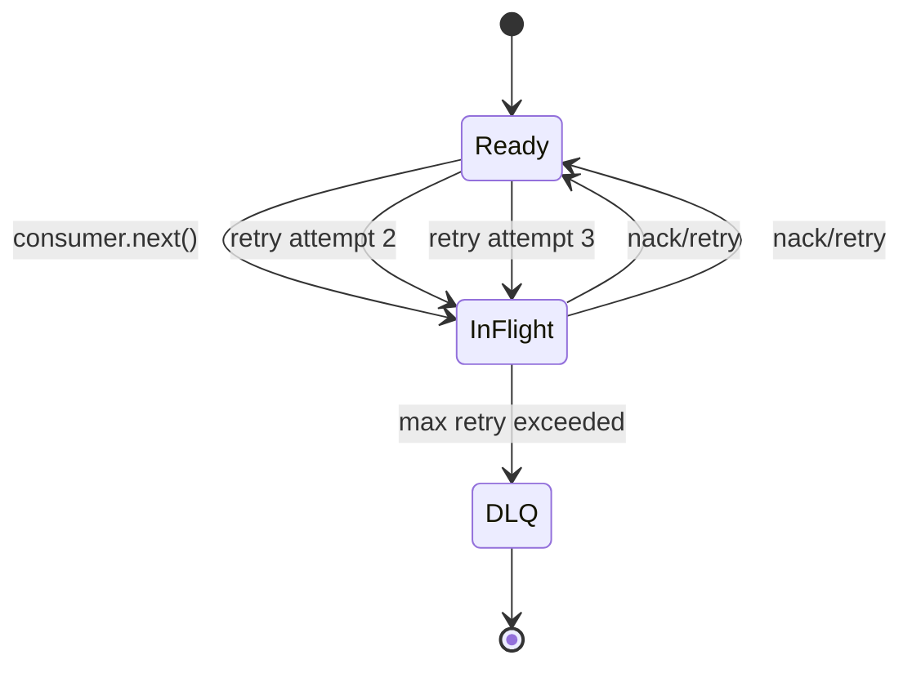

# Modul 16 — Example Apps: Publisher, Consumer, Retry, dan DLQ Demo

> Status: **wajib setelah SDK**
>
> SDK yang bagus harus punya example apps. Example apps adalah bukti bahwa broker bisa dipakai seperti library sungguhan, bukan cuma dites dari CLI.

---

## Tujuan modul

Di akhir modul ini, kamu punya folder:

```text
examples/
├── publisher-basic/
├── consumer-basic/
├── consumer-group/
├── retry-dlq-demo/
└── payment-simulation/
```

Setiap example harus bisa dijalankan sendiri dan punya README kecil.

---

## Visualisasi modul



---

## Kenapa example apps penting?

Karena orang yang baru buka repo biasanya bertanya:

```text
Cara pakainya gimana?
```

Example menjawab dengan kode nyata.

Dokumentasi menjelaskan konsep. Example membuktikan konsep.

---

## Example 1 — publisher-basic

Tujuan:

```text
Publish satu message ke topic.
```

Command:

```bash
cargo run -p publisher-basic
```

Output:

```text
published message_id=msg_000001
```

Kode inti:

```rust
let client = RQueueClient::connect("127.0.0.1:7379").await?;

let result = client
    .publish("payments.created", r#"{"id":"trx_001","amount":150000}"#)
    .await?;

println!("published message_id={}", result.message_id);
```

---

## Example 2 — consumer-basic

Tujuan:

```text
Consume message lalu ACK.
```

Command:

```bash
cargo run -p consumer-basic
```

Output:

```text
received id=msg_000001 payload={"id":"trx_001","amount":150000}
acked msg_000001
```

Kode inti:

```rust
let mut consumer = client
    .subscribe("payments.created", "fraud-worker")
    .await?;

while let Some(message) = consumer.next().await? {
    println!("received id={} payload={}", message.id, message.payload());
    message.ack().await?;
}
```

---

## Example 3 — consumer-group

Tujuan:

```text
Menunjukkan satu message hanya diproses oleh satu consumer dalam group yang sama.
```

Jalankan terminal 1:

```bash
cargo run -p consumer-group -- worker-1
```

Terminal 2:

```bash
cargo run -p consumer-group -- worker-2
```

Terminal 3:

```bash
cargo run -p publisher-basic
```

Expected behavior:

```text
worker-1 menerima sebagian message
worker-2 menerima sebagian message
message yang sama tidak diproses dua worker sekaligus
```

Visualisasi:



---

## Example 4 — retry-dlq-demo

Tujuan:

```text
Message gagal diproses beberapa kali lalu masuk DLQ.
```

Flow:



Simulasi:

```rust
while let Some(message) = consumer.next().await? {
    if message.payload().contains("force_fail") {
        println!("failed processing {}", message.id);
        message.nack().await?;
    } else {
        message.ack().await?;
    }
}
```

---

## Example 5 — payment-simulation

Tujuan:

```text
Membuat simulasi domain yang familiar untuk backend/fintech.
```

Topic:

```text
payments.created
payments.validated
payments.failed
```

Producer:

```rust
#[derive(serde::Serialize)]
struct PaymentCreated {
    id: String,
    amount: u64,
    account_id: String,
}

client.publish_json("payments.created", &event).await?;
```

Consumer:

```rust
#[derive(serde::Deserialize)]
struct PaymentCreated {
    id: String,
    amount: u64,
    account_id: String,
}

while let Some(message) = consumer.next().await? {
    let event: PaymentCreated = message.json()?;

    if event.amount > 100_000_000 {
        println!("high amount payment detected: {}", event.id);
    }

    message.ack().await?;
}
```

---

## Checklist modul

- [ ] Ada `publisher-basic`.
- [ ] Ada `consumer-basic`.
- [ ] Ada `consumer-group`.
- [ ] Ada `retry-dlq-demo`.
- [ ] Ada `payment-simulation`.
- [ ] Semua example memakai `rqueue-client`.
- [ ] Tidak ada example yang encode TCP command manual.
- [ ] Setiap example punya README singkat.
- [ ] Ada instruksi cara menjalankan server sebelum example.
- [ ] Ada expected output.

---

## Ringkasan

Example apps membuat SDK terasa real.

Tanpa example, project masih terasa library internal.

Dengan example, project berubah menjadi:

```text
broker + SDK + real usage demos
```
