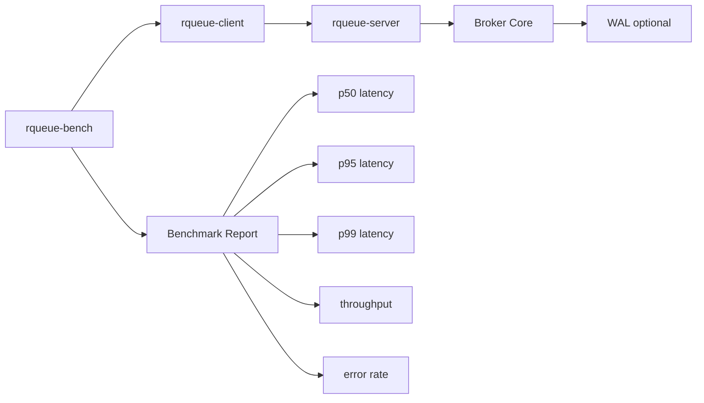
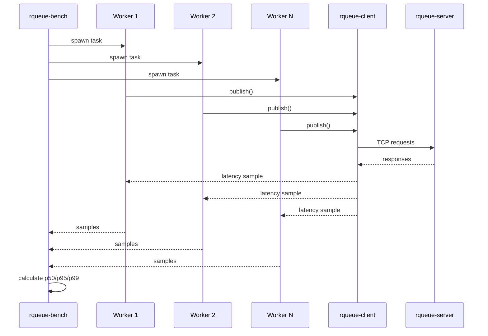

# Modul 17 — Benchmark dengan SDK

> Status: **wajib**
>
> Benchmark harus memakai SDK, bukan raw TCP langsung. Tujuannya agar angka benchmark mewakili cara aplikasi sungguhan memakai RQueue.

---

## Tujuan modul

Di akhir modul ini, kamu punya tool:

```text
crates/rqueue-bench
```

yang bisa menjalankan benchmark:

```bash
rqueue-bench pub --topic payments.created --messages 100000 --concurrency 100
rqueue-bench consume --topic payments.created --group bench-worker --messages 100000
```

---

## Visualisasi modul



---

## Kenapa benchmark lewat SDK?

Karena real app tidak akan memanggil broker dengan raw TCP manual.

Real app akan memakai SDK:

```text
application -> rqueue-client -> broker
```

Maka benchmark juga harus:

```text
rqueue-bench -> rqueue-client -> broker
```

Kalau benchmark raw TCP, angka bisa terlihat bagus tapi tidak mewakili overhead public API.

---

## Metrics yang diukur

Minimal:

| Metric | Arti |
|---|---|
| throughput | message per second |
| p50 latency | latency median |
| p95 latency | latency 95 percentile |
| p99 latency | latency 99 percentile |
| error rate | persentase request gagal |
| total duration | total waktu test |
| payload size | ukuran payload |
| concurrency | jumlah worker paralel |

---

## CLI target

Publish benchmark:

```bash
rqueue-bench pub \
  --addr 127.0.0.1:7379 \
  --topic payments.created \
  --messages 100000 \
  --concurrency 100 \
  --payload-size 512
```

Consume benchmark:

```bash
rqueue-bench consume \
  --addr 127.0.0.1:7379 \
  --topic payments.created \
  --group bench-worker \
  --messages 100000 \
  --concurrency 20
```

---

## Output target

```text
RQueue publish benchmark

addr:        127.0.0.1:7379
topic:       payments.created
messages:    100000
concurrency: 100
payload:     512 bytes

duration:    1.42s
throughput:  70,422 msg/s

latency:
  p50: 1.1ms
  p95: 4.7ms
  p99: 11.9ms

errors:      0
```

---

## Struktur benchmark tool

```text
crates/rqueue-bench/
├── Cargo.toml
└── src/
    ├── main.rs
    ├── publish.rs
    ├── consume.rs
    ├── report.rs
    └── histogram.rs
```

---

## Konsep concurrency benchmark



---

## Pseudo code publish benchmark

```rust
let client = RQueueClient::connect(addr).await?;

let started = std::time::Instant::now();
let mut handles = Vec::new();

for worker_id in 0..concurrency {
    let client = client.clone();
    let topic = topic.clone();

    let handle = tokio::spawn(async move {
        let mut samples = Vec::new();

        for i in 0..messages_per_worker {
            let payload = format!(r#"{{"worker":{},"seq":{}}}"#, worker_id, i);

            let before = std::time::Instant::now();
            client.publish(&topic, payload).await?;
            let latency = before.elapsed();

            samples.push(latency);
        }

        Ok::<_, RQueueError>(samples)
    });

    handles.push(handle);
}

let mut all_samples = Vec::new();

for handle in handles {
    let samples = handle.await??;
    all_samples.extend(samples);
}

let duration = started.elapsed();
```

Catatan: untuk ini, `RQueueClient` perlu bisa di-`clone`.

---

## Design `Clone` untuk client

Kalau client hanya menyimpan address:

```rust
#[derive(Clone)]
pub struct RQueueClient {
    addr: String,
}
```

Maka clone murah.

Tapi kalau nanti client menyimpan connection pool, design-nya perlu berubah menjadi:

```rust
#[derive(Clone)]
pub struct RQueueClient {
    inner: std::sync::Arc<ClientInner>,
}
```

---

## Checklist modul

- [ ] `rqueue-bench` memakai `rqueue-client`.
- [ ] Ada publish benchmark.
- [ ] Ada consume benchmark.
- [ ] Ada concurrency option.
- [ ] Ada payload size option.
- [ ] Ada p50/p95/p99.
- [ ] Ada throughput.
- [ ] Ada error count.
- [ ] Ada README benchmark.
- [ ] Ada hasil benchmark contoh di docs.

---

## Ringkasan

Benchmark adalah bukti bahwa project kamu bukan cuma jalan, tapi bisa diukur.

Final portfolio statement:

```text
Built a Rust message broker with SDK-based benchmark, measuring throughput,
latency percentile, retry behavior, and persistence impact.
```
