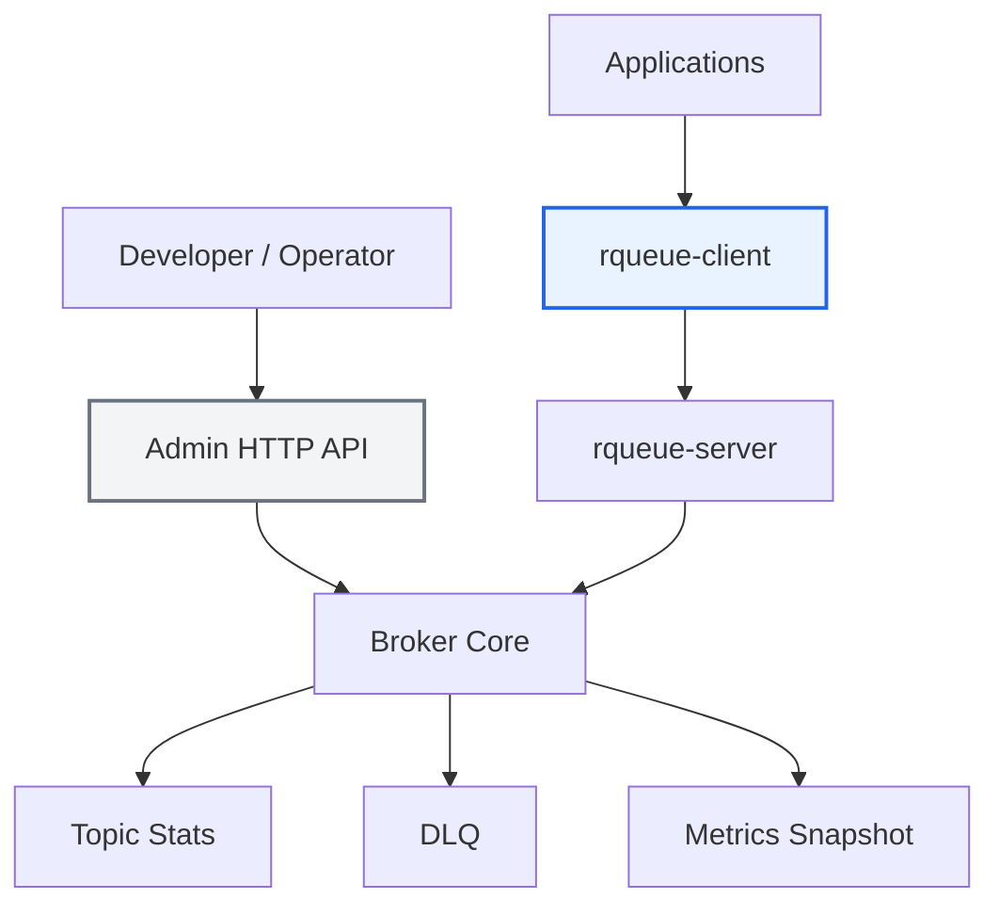

# Modul 18 — Admin API dan Observability Optional

> Status: **optional / bonus**
>
> Admin API tetap berguna, tapi posisinya bukan lagi final utama. Setelah server, SDK, example apps, dan benchmark selesai, Admin API menjadi fitur pendukung untuk inspect dan operate broker.

---

## Tujuan modul

Membuat HTTP API sederhana untuk melihat kondisi broker:

```text
GET /health
GET /topics
GET /topics/:name/stats
GET /dlq
GET /metrics
```

---

## Visualisasi modul



Admin API hanya untuk observability. App tetap memakai SDK.

---

## Endpoint minimal

### `GET /health`

Response:

```json
{
  "status": "ok"
}
```

### `GET /topics`

Response:

```json
[
  {
    "name": "payments.created",
    "ready": 10,
    "in_flight": 2,
    "dlq": 1
  }
]
```

### `GET /topics/:name/stats`

Response:

```json
{
  "name": "payments.created",
  "ready": 10,
  "in_flight": 2,
  "acked_total": 2000,
  "nacked_total": 12,
  "dlq_total": 1
}
```

### `GET /dlq`

Response:

```json
[
  {
    "topic": "payments.created",
    "group": "fraud-worker",
    "message_id": "msg_123",
    "payload": "{\"id\":\"trx_failed\"}",
    "reason": "max retry exceeded"
  }
]
```

---

## Kenapa optional?

Karena tanpa Admin API, broker masih bisa dipakai:

```text
app -> SDK -> broker
```

Tapi tanpa SDK, broker sulit dipakai aplikasi lain dengan nyaman.

Maka urutannya:

```text
SDK dulu
examples dulu
benchmark dulu
Admin API belakangan
```

---

## Implementasi dengan axum

Tambahkan dependency:

```toml
axum = "0.7"
serde = { version = "1", features = ["derive"] }
tokio = { version = "1", features = ["full"] }
```

Contoh route:

```rust
use axum::{routing::get, Router};

pub fn admin_router(state: AppState) -> Router {
    Router::new()
        .route("/health", get(health))
        .route("/topics", get(list_topics))
        .with_state(state)
}

async fn health() -> &'static str {
    "ok"
}
```

---

## Checklist modul

- [ ] Admin API tidak dipakai app utama.
- [ ] App tetap memakai SDK.
- [ ] Ada `/health`.
- [ ] Ada `/topics`.
- [ ] Ada topic stats.
- [ ] Ada DLQ view.
- [ ] Tidak expose payload sensitif tanpa pertimbangan.
- [ ] Ada catatan security untuk endpoint admin.

---

## Security note

Admin API bisa membocorkan informasi internal.

Untuk project portfolio, cukup kasih warning:

```text
This Admin API is for local development only.
Production usage requires authentication, authorization, audit logging, and payload redaction.
```

Kalau mau lebih proper:

- tambah API key,
- redact payload,
- batasi endpoint DLQ,
- log access admin,
- jangan expose ke public network.

---

## Ringkasan

Admin API tetap berguna, tapi bukan inti produk.

Inti message broker:

```text
server
protocol
SDK
delivery semantics
reliability
benchmark
```

Admin API adalah kaca spion, bukan setir.
