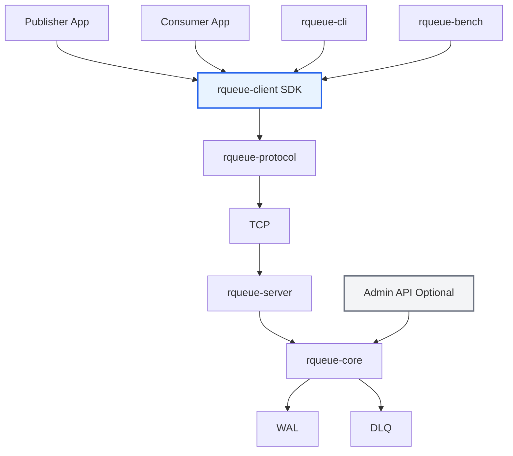

# RQueue From Zero

Belajar Rust dari nol dengan membangun message broker dari awal sampai menjadi ekosistem kecil yang bisa dipakai aplikasi lain.

Course ini dibuat untuk orang yang ingin belajar Rust secara praktis, bukan hanya membaca syntax atau membuat REST API sederhana.

Target akhir:

```text
rqueue-server
rqueue-client
rqueue-cli
rqueue-bench
examples/
docs/
```

## Apa yang akan dibangun?

RQueue adalah mini message broker.

Secara sederhana, message broker adalah sistem yang menerima message dari publisher, menyimpan message tersebut di topic, lalu mengirimkannya ke consumer.

Contoh dunia nyata:

```text
payment-service publish event payments.created
fraud-worker consume event payments.created
notification-worker consume event payments.created
```

Di project ini, kamu akan membangun:

- TCP server
- custom text protocol
- protocol parser
- in-memory broker
- topic queue
- producer dan consumer
- ACK
- NACK
- retry
- visibility timeout
- Dead Letter Queue
- Write-Ahead Log
- crash recovery
- Rust client SDK
- publisher example
- consumer example
- benchmark tool
- Admin API optional

## Kenapa Rust?

Rust cocok untuk project ini karena kamu akan belajar langsung konsep yang memang penting dalam sistem backend:

- ownership
- borrowing
- lifetime secara bertahap
- error handling
- module system
- testing
- async programming
- TCP networking
- concurrency
- state machine
- persistence
- performance measurement

Rust tidak dipelajari sebagai syntax saja, tapi sebagai alat untuk membangun komponen backend yang nyata.

## Urutan belajar

```text
00_COURSE_MAP.md
01_SETUP_RUST.md
02_RUST_BASIC.md
03_OWNERSHIP_BORROWING.md
04_STRUCT_ENUM_RESULT.md
05_CARGO_MODULE_TEST.md
06_CLI_CLAP_SERDE.md
07_ASYNC_TOKIO.md
08_TCP_PROTOCOL.md
09_PROJECT_SCAFFOLD.md
10_PROTOCOL_PARSER.md
11_IN_MEMORY_BROKER.md
12_TCP_SERVER_AND_CLI.md
13_ACK_RETRY_DLQ.md
14_WAL_RECOVERY.md
15_CLIENT_SDK.md
16_EXAMPLE_APPS.md
17_BENCHMARK.md
18_ADMIN_API_OPTIONAL.md
```

## Final architecture



## Cara pakai course ini

Mulai dari:

```text
START_HERE.md
```

Lalu ikuti modul satu per satu.

Jangan lompat langsung ke final project kalau kamu benar-benar mulai dari nol. Rust punya konsep ownership dan borrowing yang perlu dibiasakan dari awal.

## Cara membuat project scaffold

Jalankan:

```bash
chmod +x support/scaffold-rqueue.sh
./support/scaffold-rqueue.sh rqueue
cd rqueue
```

Script ini akan membuat workspace awal:

```text
rqueue/
├── Cargo.toml
├── crates/
│   ├── rqueue-core/
│   ├── rqueue-protocol/
│   ├── rqueue-server/
│   ├── rqueue-client/
│   ├── rqueue-cli/
│   └── rqueue-bench/
├── examples/
└── docs/
```

## Output akhir yang diharapkan

Di akhir course, kamu punya project yang bisa dijelaskan seperti ini:

> I built a Rust message broker from scratch with a TCP protocol, broker engine, ACK/NACK, retry, DLQ, WAL recovery, client SDK, examples, and benchmark tooling.

Bukan hanya:

> I learned Rust syntax.

## Cara membaca HTML viewer

Buka:

```text
index.html
```

Atau jalankan local server:

```bash
python3 -m http.server 8000
```

Lalu buka:

```text
http://localhost:8000
```
