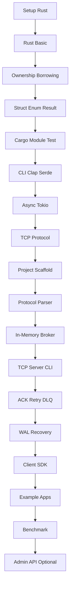
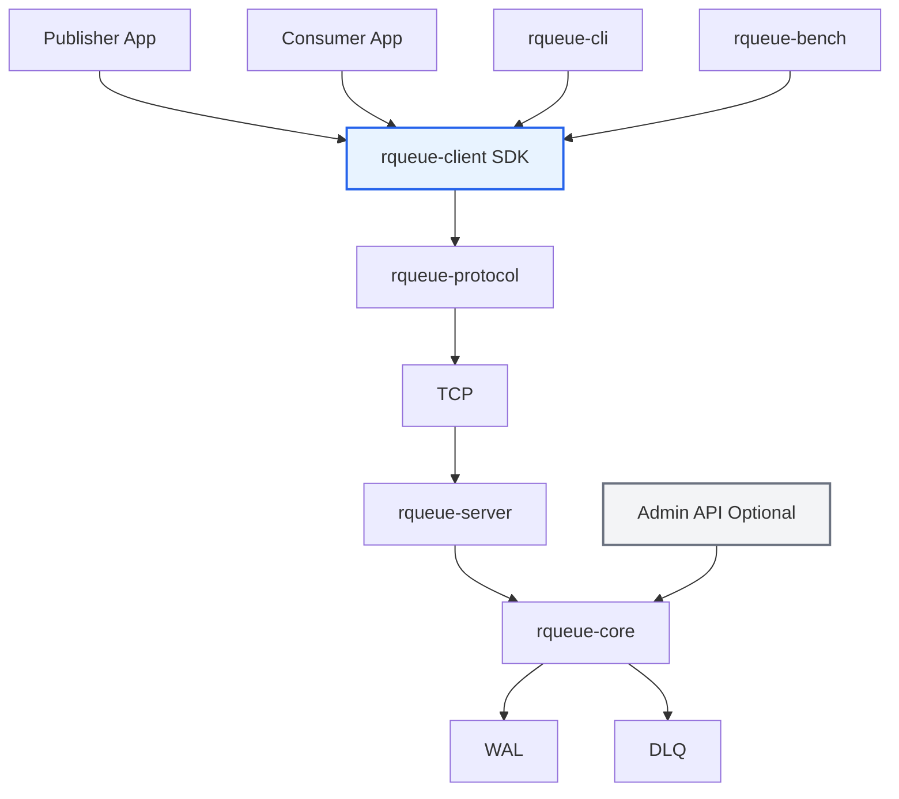
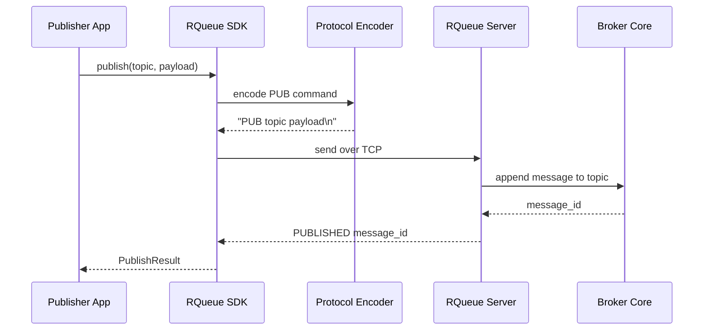
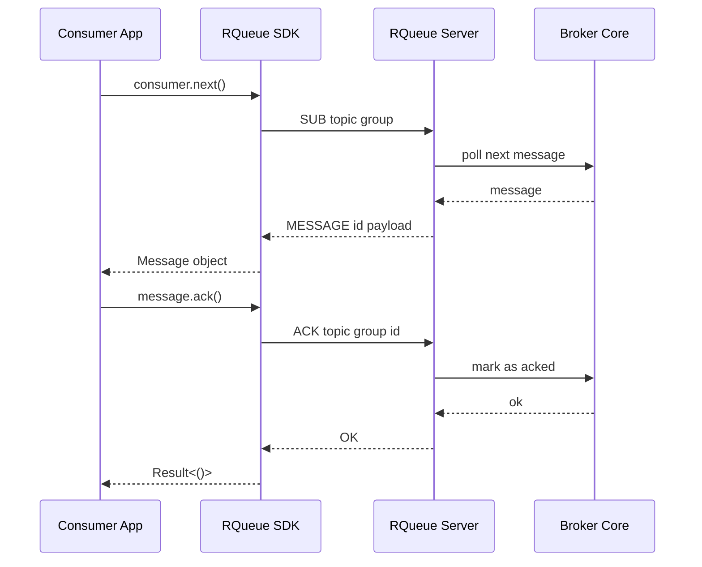
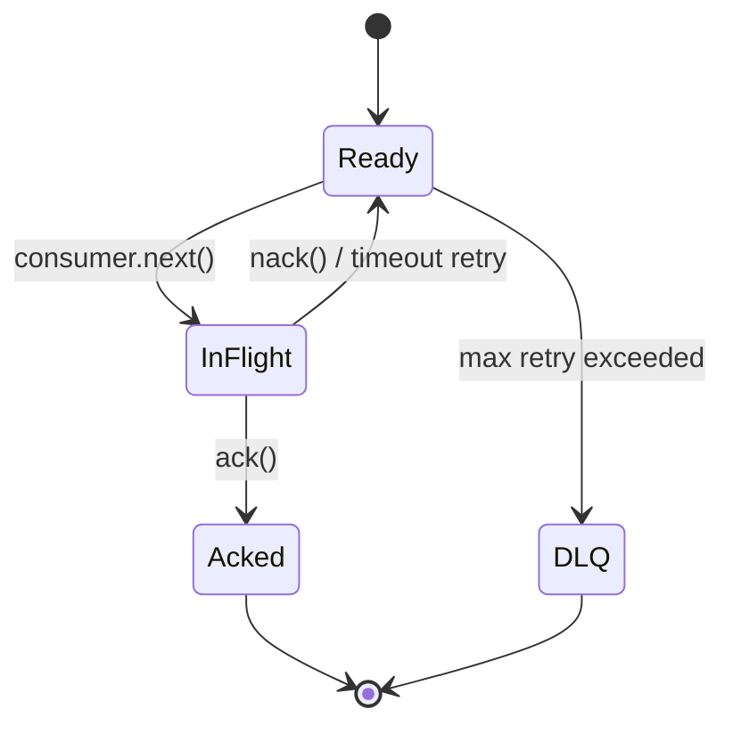
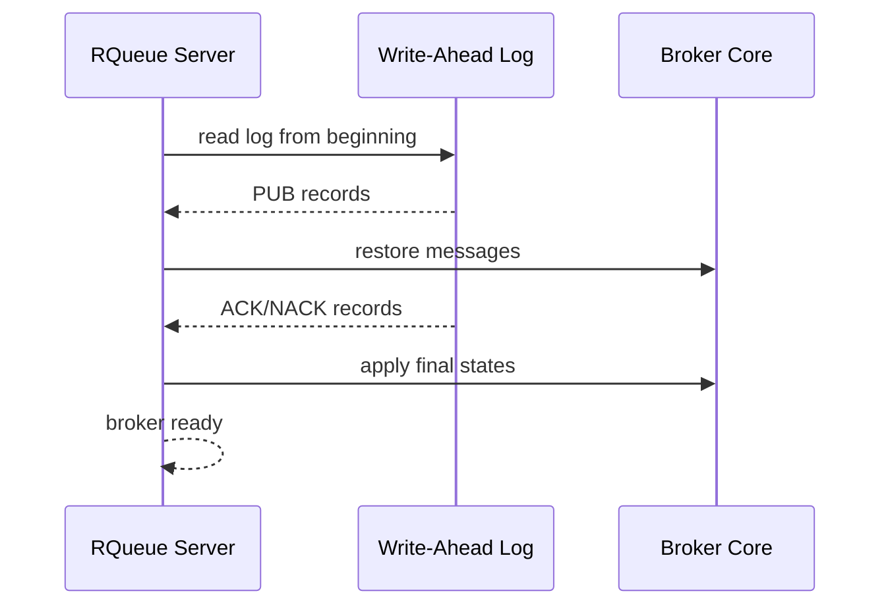

# Mermaid Diagrams

Dokumen ini mengumpulkan diagram besar untuk course RQueue.

Setiap modul juga punya diagram kontekstual di dalam file modul masing-masing.

## Course Flow

## Final Architecture

## Publisher Flow

## Consumer Flow

## Message Lifecycle

## WAL Recovery

